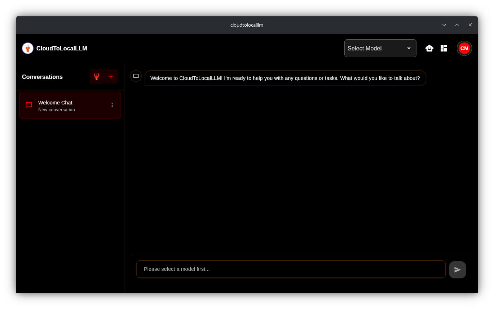

# CloudToLocalLLM 🦞 — Secure Agent Companion

<div align="center">
  
[](https://opensource.org/licenses/MIT)
[](https://flutter.dev)
[](https://nodejs.org)
[]()
[]()

**A local-first companion shell for Hermes, OpenClaw, and other agent runtimes. Secure channel, avatar/voice companion, vision, and permissioned desktop control across your devices.**

_Private AI, local control, secure hands and eyes on your desktops._ 🦞</div>

---

## 🤖 Hermes Agent compatibility

This repository includes `AGENTS.md`, `SOUL.md`, `USER.md`, and `SESSION_REENTRY.md` so Hermes Agent can load workspace instructions, project identity, human context, and a quick reentry path automatically.

---

## 🚀 Overview

**CloudToLocalLLM** is a local-first companion and desktop capability layer for user-selected agent runtimes. The main window is a secure direct channel to the active agent runtime, with Hermes as the current first test path. OpenClaw and compatible custom agent gateways remain supported through setup and runtime adapters.

Ollama, LM Studio, and similar local model servers are support model providers, not primary app runtimes. They can power memory, embeddings, summarization, semantic search, OCR cleanup, speech helpers, and other app-owned background intelligence.

The desktop app can be installed on all of your devices. With cloud mode and Tailscale, those devices can stay in sync while desktop control and vision remain device-scoped and permissioned.

> **Note:** The project is currently in **Heavy Development/Early Access**.

## ✨ Core Pillars

| Pillar | Description |
| --- | --- |
| **💬 Secure Agent Channel** | Main direct channel to the selected agent runtime, synced across authorized devices when enabled |
| **🦞 Avatar & Voice Companion** | Sidecar companion window with personality, memory, voice state, and reactions |
| **💻 Desktop Control** | Permissioned hands-on access to selected desktops: apps, windows, keyboard, files, clipboard, commands |
| **👁️ Vision** | Screen, region, OCR, and camera awareness with explicit user control |
| **🧠 Runtime & Agent Management** | Manage Hermes, OpenClaw, agents, skills, sessions, tools, local support models, and diagnostics when needed |
| **🔐 Secure Device Mesh** | Tailscale-first private connectivity plus optional isolated per-user cloud connector |

## 📋 Prerequisites

- **An agent runtime:** Hermes is the current first test path. OpenClaw and compatible agent gateways can be configured through setup.
- **Optional local model provider:** Ollama, LM Studio, or a custom local model endpoint for memory and other app-owned support features.
- **Optional [Tailscale](https://tailscale.com/):** Recommended for connecting devices and agent runtimes across your private network.
- **Optional GPU drivers:** Required only if your chosen agent runtime or support model stack needs GPU acceleration.

## 🚀 Quick Install

**Linux:**
```bash
curl -fsSL https://cloudtolocalllm.online/install.sh | bash
```

**Windows (PowerShell):**
```powershell
iwr -useb https://cloudtolocalllm.online/install.ps1 | iex
```

See **[Linux Installation](#linux-installation)** below for advanced installation options, auto-updates, and manual setup instructions.

**Manual Download:** Visit the **[Latest Releases](https://github.com/CloudToLocalLLM-online/CloudToLocalLLM/releases/latest)** page to download installers for Windows (.exe), Linux (.AppImage), or source code.

### Linux Installation

#### Quick Install

Install CloudToLocalLLM on Linux with a single command:

```bash
curl -fsSL https://cloudtolocalllm.online/install.sh | bash
```

This automatically:
- Downloads the latest AppImage for your system
- Installs to `~/.local/share/cloudtolocalllm` (or `/opt/cloudtolocalllm` with `--system`)
- Creates desktop entries and menu shortcuts
- Sets up the **background update daemon** for automatic updates
- Configures the systemd timer for update checks

> **New:** The installer now includes an intelligent update daemon that automatically keeps CloudToLocalLLM up-to-date. Patch updates are installed silently, while minor/major updates prompt for your approval.

#### Installation Options

The installer supports several options for customizing your installation:

```bash
# System-wide installation (requires sudo)
curl -fsSL https://cloudtolocalllm.online/install.sh | bash -s -- --system

# Beta channel (receive pre-release updates)
curl -fsSL https://cloudtolocalllm.online/install.sh | bash -s -- --channel beta

# Custom installation directory
curl -fsSL https://cloudtolocalllm.online/install.sh | bash -s -- --dir /opt/cloudtolocalllm

# Skip update daemon installation
curl -fsSL https://cloudtolocalllm.online/install.sh | bash -s -- --no-daemon

# Silent installation (suppress output except errors)
curl -fsSL https://cloudtolocalllm.online/install.sh | bash -s -- --silent
```

**Installation Types:**
- **User-local** (default): Installs to `~/.local/share/cloudtolocalllm` - no sudo required
- **System-wide** (`--system`): Installs to `/opt/cloudtolocalllm` - requires sudo, available to all users

**Update Channels:**
- **stable** (default): Production-ready releases only
- **beta**: Pre-release versions with latest features
- **edge**: Development builds (may be unstable)

#### Manual Installation

If you prefer manual installation or the installer doesn't work for your distribution:

1. **Download the AppImage:**

```bash
# Download latest release
wget https://github.com/CloudToLocalLLM-online/CloudToLocalLLM/releases/latest/download/CloudToLocalLLM-x86_64.AppImage

# Or use curl
curl -L -o CloudToLocalLLM-x86_64.AppImage https://github.com/CloudToLocalLLM-online/CloudToLocalLLM/releases/latest/download/CloudToLocalLLM-x86_64.AppImage
```

2. **Make it executable:**

```bash
chmod +x CloudToLocalLLM-x86_64.AppImage
```

3. **Run the application:**

```bash
./CloudToLocalLLM-x86_64.AppImage
```

4. **Optional: Create desktop entry** (for app launcher integration):

```bash
# Install to local applications
mkdir -p ~/.local/share/applications
cat > ~/.local/share/applications/cloudtolocalllm.desktop << EOF
[Desktop Entry]
Version=1.0
Type=Application
Name=CloudToLocalLLM
GenericName=AI Model Bridge
Comment=Manage and run powerful Large Language Models locally
Exec=$(pwd)/CloudToLocalLLM-x86_64.AppImage %u
Terminal=false
Categories=Development;Utility;Network;
Keywords=AI;Agent;LLM;Desktop;Local;
StartupNotify=true
EOF

# Update desktop database
update-desktop-database ~/.local/share/applications
```

#### Auto-Updates

> **✨ Fully Implemented:** CloudToLocalLLM now includes an intelligent background update daemon that keeps your installation current with minimal disruption.

The update daemon is **automatically installed** with the one-line installer and runs as a systemd user service.

**Update Schedule:**
- Checks for updates every **6 hours** (configurable)
- Runs in the background as a systemd user service
- Minimal resource usage - wakes only to check for updates

**Smart Update Behavior:**

| Update Type | Example | Action |
|-------------|---------|--------|
| **Patch** | `10.1.200 → 10.1.201` | Auto-installed silently |
| **Minor** | `10.1.200 → 10.2.0` | Desktop notification prompt |
| **Major** | `10.1.200 → 11.0.0` | Desktop notification prompt |

**How It Works:**
1. The update daemon (`cloudtolocalllm-updated`) queries GitHub Releases API
2. Compares current version with latest release using semantic versioning
3. **Patch updates**: Downloads and installs automatically in the background
4. **Minor/Major updates**: Sends desktop notification (via `notify-send`) for approval
5. Updates are applied on next app restart (no interruption to active sessions)

**Manual Update Checks:**
Check for updates anytime from within the app:
1. Open **Config** screen (gear icon in sidebar)
2. Go to **System** tab
3. Click **Check Now** in Software Updates section
4. Available updates show download/install options

**Manage Update Daemon:**

```bash
# Check status
systemctl --user status cloudtolocalllm-updated.timer

# View logs
journalctl --user -u cloudtolocalllm-updated.service -f

# Disable auto-updates
systemctl --user stop cloudtolocalllm-updated.timer
systemctl --user disable cloudtolocalllm-updated.timer

# Re-enable auto-updates
systemctl --user start cloudtolocalllm-updated.timer
systemctl --user enable cloudtolocalllm-updated.timer
```

**Update State Location:**
```bash
~/.config/cloudtolocalllm/update-state.json
```

### Docker Deployment

For production deployments or self-hosted setups, CloudToLocalLLM includes a complete Docker Compose stack with:

- **API Backend** (Express.js) - REST API with Auth0 JWT
- **Streaming Proxy** - WebSocket proxy for real-time LLM streaming
- **Redis** - Rate limiting cache
- **Traefik** - Reverse proxy with automatic SSL (Let's Encrypt)
- **Prometheus** - Metrics collection
- **Grafana** - Monitoring dashboards

**Quick Start:**

```bash
# Clone and configure
git clone https://github.com/CloudToLocalLLM-online/CloudToLocalLLM.git
cd CloudToLocalLLM
cp docker-compose.env.example .env
# Edit .env with your configuration

# Deploy to Docker Swarm
docker stack deploy -c docker-compose.prod.yml cloudtolocalllm
```

See **[DEPLOYMENT.md](DEPLOYMENT.md)** for complete deployment guide, including LXC container setup and production configuration.

### Web Version

Latest web deployment: **[cloudtolocalllm.online](https://cloudtolocalllm.online)**

## 📖 Documentation

- **[SPEC.md](SPEC.md):** Master specification — project vision, architecture, and feature definitions.
- **[User Guide](docs/user-guide/USER_GUIDE.md):** Features and detailed usage.
- **[Setup Guide](docs/user-guide/SETUP_GUIDE.md):** Step-by-step installation.
- **[Troubleshooting](docs/user-guide/TROUBLESHOOTING.md):** Common issues and fixes.
- **[System Architecture](docs/architecture/SYSTEM_ARCHITECTURE.md):** Technical deep dive.
- **[Agent Runtime Contract](docs/architecture/AGENT_RUNTIME_CONTRACT.md):** Required split between agent runtimes and support model providers.
- **[Secure Device Mesh](docs/architecture/SECURE_DEVICE_MESH.md):** Tailscale-first multi-device and cloud connector architecture.
- **[Avatar System](docs/architecture/AVATAR_SYSTEM.md):** Evolving avatar architecture.
- **[Desktop Control](docs/architecture/DESKTOP_CONTROL.md):** GUI automation and system integration.
- **[Vision System](docs/architecture/VISION_SYSTEM.md):** Screen and camera capabilities.

## 🖼️ Screenshots

<div align="center">
  
  <p><em>Home Screen - Unified Chat Interface</em></p>
</div>

## 🛠️ Development

### Tech Stack

- **Frontend:** Flutter 3.5+ (Linux, Windows, Web)
- **Agent runtime adapters:** Hermes first for current testing, with OpenClaw and compatible agent gateways supported through setup.
- **Support model providers:** Ollama, LM Studio, and compatible local model endpoints for memory and background intelligence.
- **Backend:** Node.js 22.x (Express.js)
- **Local Database:** SQLite via Drift (LocalBrain)
- **Authentication:** Auth0

### Build from Source

1.  **Clone:** `git clone https://github.com/CloudToLocalLLM-online/CloudToLocalLLM.git`
2.  **Start an agent runtime:** Hermes is the current first test path; OpenClaw or another compatible agent gateway can also be used.
3.  **Deps:** `flutter pub get` && `(cd services/api-backend && npm install)`
4.  **Run:** `flutter run -d linux` (Desktop) or `flutter run -d chrome` (Web)

## 📄 License

This project is licensed under the **MIT License**.

# Trigger deployment
