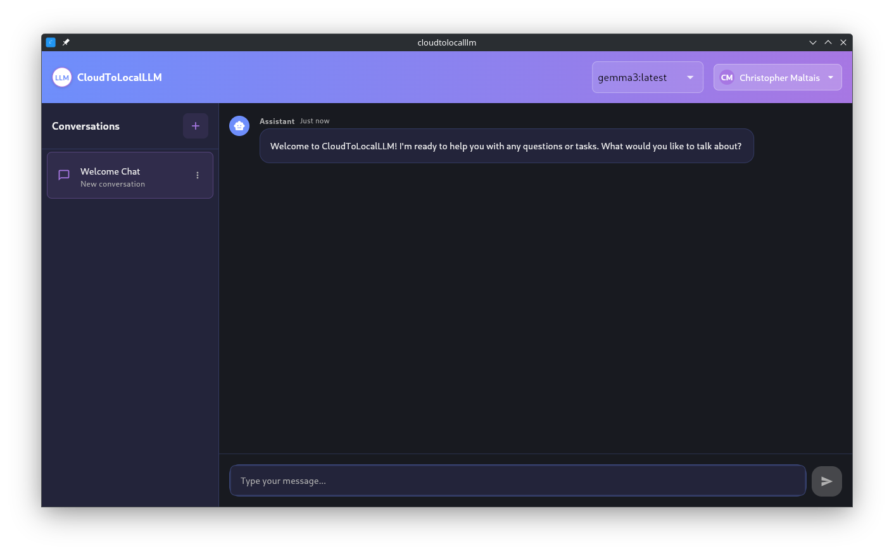
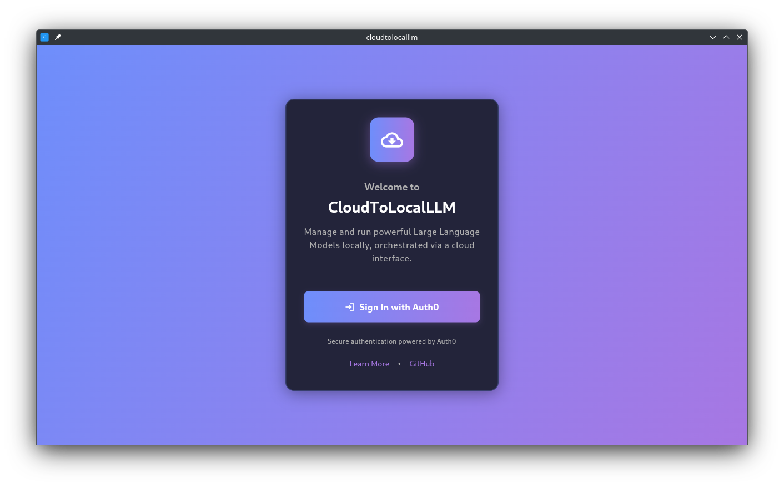
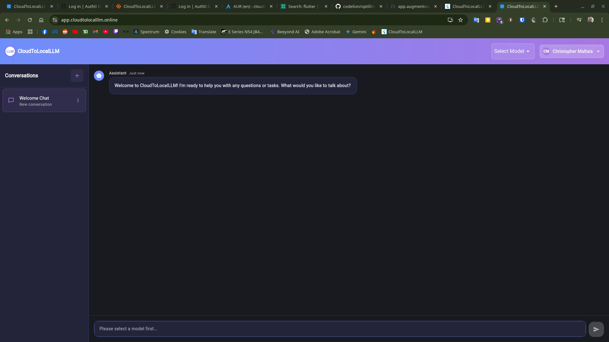
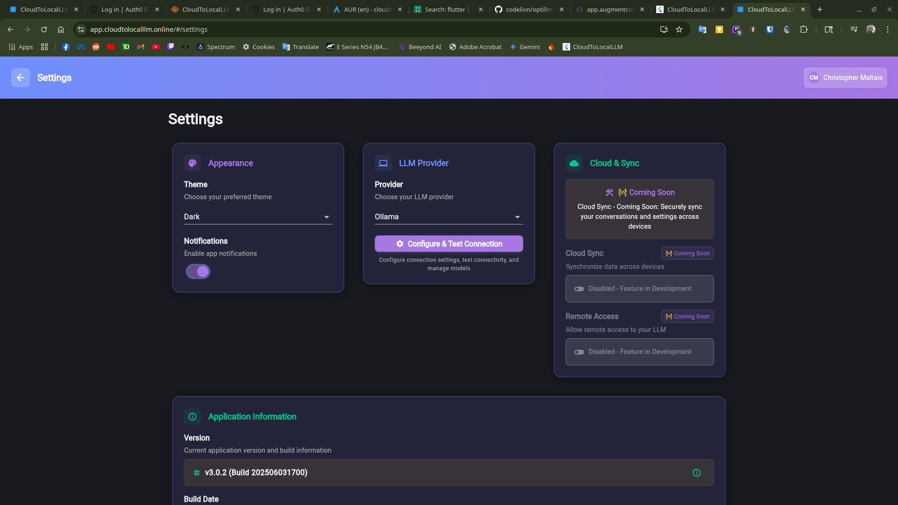

<!-- AI Review Breadcrumb: Last reviewed 2024-05-16. Focus on deployment, SSL, and PWA elements. -->
# CloudToLocalLLM: Your Personal AI Powerhouse 🌩️💻

**Website: [https://cloudtolocalllm.online](https://cloudtolocalllm.online)**

Run powerful Large Language Models (LLMs) directly on your machine and seamlessly sync your conversations to the cloud. Experience the best of local control and cloud convenience.

## 🏗️ Multi-Container Architecture

CloudToLocalLLM now features a modern multi-container architecture that provides:

- **Independent Deployments**: Update Flutter app, documentation, or API backend separately
- **Zero-Downtime Updates**: Rolling updates with health checks
- **Scalability**: Individual container scaling and load balancing
- **Security**: Container isolation and non-root execution

### Architecture Overview

```
Internet → Nginx Proxy → Static Site (docs.cloudtolocalllm.online)
                      → Flutter App (app.cloudtolocalllm.online)
                      → API Backend (WebSocket + REST)
```

For detailed information, see [MULTI_CONTAINER_ARCHITECTURE.md](docs/MULTI_CONTAINER_ARCHITECTURE.md).

## ✨ Features

- Run LLMs locally using Ollama or LM Studio
- Hardware detection for optimal model recommendations
- Support for latest models (Llama 3, Gemma 3, Phi-3, Mistral, etc.)
- Optional cloud synchronization of conversations (premium feature)
- Remote access to your local LLM
- Modern, responsive UI
- Cross-platform support

## 📸 Screenshots

### Desktop Application (Linux)

#### Chat Interface

*Modern chat interface with dark theme, showing conversation with local LLM*

#### Login Screen

*Clean authentication interface with Auth0 integration*

### Web Application

#### Web Chat Interface

*Responsive web interface accessible from any browser*

#### Settings Panel

*Comprehensive settings panel for configuration and preferences*

## Hardware Detection & Model Recommendations

CloudToLocalLLM automatically detects your hardware capabilities and recommends appropriate models:

- **System RAM Detection**: Identifies available system memory
- **GPU Detection**: Detects NVIDIA, AMD, and Intel GPUs when available
- **VRAM Analysis**: Measures available VRAM for optimal model selection
- **Smart Recommendations**: Suggests models based on your specific hardware profile

> For detailed information about hardware detection and model recommendations, see [OLLAMA_INTEGRATION.md](docs/OLLAMA_INTEGRATION.md)

## Data Storage and Privacy

### Local Storage (Default)
- All conversations and data are stored locally by default
- No data is sent to the cloud unless explicitly enabled
- Full control over your data and privacy

### Cloud Storage (Premium)
> **Important Security Warning**: Cloud storage is a premium feature that requires careful consideration:
> - Your data is encrypted but stored on our servers
> - If you lose your access code, we CANNOT recover your data
> - We recommend keeping a secure backup of your access code
> - Cloud storage is subject to our [Privacy Policy](docs/PRIVACY.md) and [Terms of Service](docs/TERMS.md)

## 🎛️ Enhanced System Tray Architecture

CloudToLocalLLM features an **Enhanced System Tray Architecture** that provides independent, reliable system tray functionality with universal connection management:

### Key Features
- **Independent Operation**: System tray daemon operates independently of the main Flutter app
- **Universal Connection Broker**: Handles ALL connections (local Ollama + cloud proxy) through a centralized broker
- **Crash Isolation**: Tray daemon failures don't affect the main application
- **Separate Settings Interface**: Independent configuration and monitoring GUI
- **Automatic Failover**: Intelligent switching between local and cloud connections

### System Tray Functionality
- **Persistent Tray Icon**: Always available with connection status indicators
- **Quick Actions**: Show/Hide window, Settings, Connection status, Quit
- **Authentication-Aware Menus**: Dynamic menu based on login status
- **Real-time Status**: Live connection monitoring and health checks

### Connection Management
- **Unified API**: Single interface for both local Ollama and cloud connections
- **Automatic Discovery**: Detects and connects to the best available service
- **Health Monitoring**: Continuous connection health checks with automatic recovery
- **Request Proxying**: All API calls routed through the connection broker

For detailed information about the enhanced architecture, see [Enhanced System Tray Architecture](tray_daemon/ENHANCED_ARCHITECTURE.md).

## Core Features vs Premium Features

### ✅ **Core Features (Included)**
- **Basic Sync**: Conversation synchronization across devices
- **Local LLM Management**: Full Ollama and LM Studio integration
- **System Tray Integration**: Enhanced desktop experience with Python-based daemon
- **Cross-Platform Support**: Linux, Windows, macOS, and web
- **Modern UI**: Dark theme with Material Design 3

### 💎 **Premium Features (Future Paid Upgrades)**
- **Advanced Cloud Sync**: Settings and preferences synchronization across devices
- **Cloud LLM Access**: Access to leading models like OpenAI (GPT-4o, GPT-4 Turbo) and Anthropic (Claude 3)
- **Remote Access**: Secure access to your local LLM from anywhere
- **Advanced Model Management**: Performance optimization tools and analytics
- **Priority Support**: Dedicated technical support and feature requests

> For more details about upcoming premium features and their development status, see [PREMIUM_FEATURES.md](docs/PREMIUM_FEATURES.md)

## 📋 Versioning Strategy

CloudToLocalLLM uses a granular build numbering system:

**Format**: `MAJOR.MINOR.PATCH+BUILD`

- **Major (x.0.0)**: Creates GitHub releases - significant changes
- **Minor (x.y.0)**: No GitHub release - feature additions
- **Patch (x.y.z)**: No GitHub release - bug fixes
- **Build (x.y.z+nnn)**: No GitHub release - incremental builds

**Examples**: `3.1.1+001` → `3.1.1+002` → `3.1.2+001` → `4.0.0+001`

For detailed information, see [Versioning Strategy](docs/VERSIONING_STRATEGY.md).

## 🚀 Deployment

### Multi-Container Deployment (Recommended)

Deploy all services with the new multi-container architecture:

```bash
# Full deployment with SSL setup
./scripts/deploy/deploy-multi-container.sh --build --ssl-setup

# Deploy specific services only
./scripts/deploy/deploy-multi-container.sh flutter-app
./scripts/deploy/update-service.sh static-site --no-downtime
```

### Legacy Single Container

For instructions on self-hosting CloudToLocalLLM with the legacy single container, including SSL setup, prerequisites, and advanced deployment, please see our [Self-Hosting Guide](docs/SELF_HOSTING.md).

## 📁 Project Structure

CloudToLocalLLM follows an organized directory structure for better maintainability and development:

### Core Directories
- `lib/` - Flutter application source code
- `api-backend/` - Node.js backend server
- `tray_daemon/` - System tray daemon implementation
- `web/` - Web-specific Flutter assets

### Documentation
- `docs/` - Comprehensive project documentation
  - Architecture guides, deployment instructions, troubleshooting
  - User guides, setup instructions, and API documentation

### Scripts & Automation
- `scripts/` - Organized build, deployment, and utility scripts
  - `build/` - Build scripts for different platforms
  - `deploy/` - Deployment and VPS scripts
  - `setup/` - Initial server setup scripts
  - `release/` - Release management and distribution
  - `ssl/` - SSL certificate management
  - `verification/` - Testing and verification tools

### Packaging & Distribution
- `packaging/` - Platform-specific packaging configurations
  - DEB packages, AppImage, Windows installers
- `installers/` - Installation scripts and packages
- `aur-package/` - Arch User Repository (AUR) package files

### Configuration & Infrastructure
- `config/` - Configuration files for various platforms
- `docker/` - Docker containers and build contexts
- `static_homepage/` - Project website and documentation site

### Development Tools
- `.vscode/` - VS Code workspace configuration
- `linux/`, `assets/` - Platform-specific assets and configurations

For detailed information about any component, see the respective README files in each directory.

## 🚀 Getting Started

### Connecting to Local LLM

1. Open the app and navigate to Settings
2. Select your LLM provider (Ollama or LM Studio)
3. Configure the IP address and port if different from default
4. Create a new conversation and start chatting!

### Model Management

CloudToLocalLLM provides comprehensive model management features:

1. **Browse Models**: View available models for your selected provider
2. **Download Models**: Pull models directly from within the app
3. **Auto-Recommendations**: Get model suggestions based on your hardware
4. **Model Information**: View model details, including size and capabilities

### Cloud Synchronization (Premium)

> **Note**: Cloud synchronization is a premium feature (free during testing) that requires:
> - A valid subscription (waived during testing)
> - Explicit opt-in
> - Secure access code setup
> - Understanding of data security implications

1. Create an account or log in
2. Enable cloud synchronization in Settings
3. Set up your secure access code
4. Your conversations will sync when you're online

### Remote Access

1. Log in to your account
2. Enable tunnel in Settings
3. Your local LLM will be accessible via the provided URL

## 🏗️ Project Structure

- `lib/`: Main Flutter application code (client-side UI and logic).
- `tray_daemon/`: **Enhanced System Tray Architecture** - Independent tray daemon with universal connection management.
  - `enhanced_tray_daemon.py`: Main enhanced tray daemon with connection broker.
  - `connection_broker.py`: Universal connection broker for local and cloud services.
  - `settings_app.py`: Independent GUI for daemon configuration.
  - `start_enhanced_daemon.sh`: Startup script for the enhanced daemon.
  - `ENHANCED_ARCHITECTURE.md`: Comprehensive architecture documentation.
- `admin_control_daemon/`: Dart-based daemon for managing the application stack on a server.
  - `bin/server.dart`: Entrypoint for the admin daemon.
- `admin-ui/`: Vue.js based admin interface. (Status: Potentially for specific admin tasks, primary user interface is the Flutter app).
- `assets/`: Global assets for the Flutter application (e.g., images, icons).
- `config/`: Configuration files for various parts of the stack.
  - `docker/`: Contains Dockerfiles (e.g., `Dockerfile.admin_daemon`, `Dockerfile.web`) and Docker Compose files (e.g., `docker-compose.yml`, `docker-compose.admin.yml`).
  - `nginx/`: Nginx configuration templates (e.g., `nginx.conf`) used by the `webapp` service.
  - `systemd/`: Example systemd service files (e.g., `cloudtolocalllm.service`), primarily for scenarios where services might be run outside Docker.
- `scripts/`: Utility scripts for development, deployment, maintenance, and build tasks. See "Key Scripts Overview" below for more details.
  - `auth0/`, `deploy/`, `maintenance/`, `powershell/`, `release/`, `setup/`, `ssl/`, `utils/`, `verification/`: Subdirectories categorizing various scripts.
- `docs/`: Detailed documentation for different aspects of the project.
- `android/`, `ios/`, `web/`, `windows/`, `macos/`, `linux/`: Platform-specific code and build configurations for the Flutter application.
- `tunnel_service/` (in `backend/`): Dart project for ngrok-like tunneling, enabling remote access.
- `auth_service/` (likely related to FusionAuth): Backend authentication service components.
- `backend/`: Contains backend services like `tunnel_service`.

## 🔧 Key Scripts Overview

This project includes a variety of scripts to automate common tasks. Here are some of the key ones:

- **Server Management & Deployment (primarily for Linux VPS):**
  - `scripts/setup_cloudllm_user.sh`: Sets up a dedicated `cloudllm` user with necessary permissions and SSH configuration on a new VPS.
  - `scripts/deploy_vps.sh`: Automates the initial deployment of the application stack to a VPS, including system checks, Docker/Docker Compose installation, UFW/Fail2ban setup, and initial application startup.
  - `scripts/manual_staging_wildcard.sh` (and its production version): Manages Let's Encrypt SSL certificate generation and renewal using Certbot with a manual DNS challenge for wildcard domains. Used for setting up HTTPS for `https://cloudtolocalllm.online` and its subdomains.
  - `scripts/fix_service.sh`: Utility to overwrite the systemd service file for `cloudtolocalllm.service` and restart it.
  - `scripts/troubleshooting_commands.sh`: A collection of useful commands for diagnosing issues on the VPS, particularly related to Docker and service logs.
- **Application Building & Packaging:**
  - `scripts/improve_windows_app.ps1` (PowerShell): Builds the Flutter Windows application and creates an Inno Setup installer. Includes features like version extraction from `pubspec.yaml` and GUID generation.
  - `PKGBUILD.template`: A template for creating an Arch Linux package (for AUR distribution) from a pre-built Flutter Linux release.
  - `scripts/generate_icons.ps1` (PowerShell) & `generate_icons.bat`: Scripts for generating application icons using ImageMagick.
- **Development & Utility:**
  - `scripts/git-push.ps1` (PowerShell): Automates common Git operations like adding, committing, and pushing changes.
  - `scripts/logging.ps1` (PowerShell): Provides log rotation functionality.
  - `scripts/ollama_service_manager.ps1` (PowerShell): Manages a locally installed Ollama service (start, stop, status).
  - `scripts/organize_scripts.ps1` (PowerShell): Helps organize scripts into subdirectories.
  - `scripts/update_references.ps1` (PowerShell): Updates references to scripts if they are moved.
  - `scripts/test_installation.ps1` (PowerShell): Contains functions to test aspects of the local setup, like Ollama API reachability.

For detailed usage, refer to the scripts themselves or related documentation.

##📦 Building Client Applications

Instructions for building and packaging client applications for different platforms:

### Windows

1.  **Prerequisites**:
    *   Flutter SDK installed and configured.
    *   Inno Setup 6 installed (e.g., from [https://jrsoftware.org/isinfo.php](https://jrsoftware.org/isinfo.php)), and `ISCC.exe` should be in your system PATH or one of the common installation locations checked by the script.
    *   A `LICENSE` file in the project root.
2.  **Build Process**:
    *   Run the `scripts/improve_windows_app.ps1` PowerShell script.
    *   This script will:
        *   Read the application version from `pubspec.yaml`.
        *   Build the Flutter Windows application (`flutter build windows`).
        *   Generate an Inno Setup script (`.iss`) file.
        *   Compile the installer using `ISCC.exe`.
        *   The resulting installer will be placed in the `installer/` directory.
3.  **Code Signing (Manual Step)**: For a trusted installation, the generated executable and installer should be signed with a valid code signing certificate. This step is typically performed manually after the build.

### Linux (AUR Package)

1.  **Prerequisites**:
    *   Flutter SDK installed and configured.
    *   Arch Linux environment with `base-devel` package group installed (for `makepkg`).
    *   A `LICENSE` file in the project root.
2.  **Build Flutter App**:
    *   Generate a release build of the Flutter Linux application:
        ```bash
        flutter build linux --release
        ```
    *   This will create the application bundle in `build/linux/x64/release/bundle/`.
3.  **Create Release Artifact**:
    *   Archive the contents of the `build/linux/x64/release/bundle/` directory into a `.tar.gz` file. The `PKGBUILD.template` expects this tarball to contain the `bundle/` directory at its root, or a single top-level directory which then contains `bundle/`. Name it appropriately, e.g., `cloudtolocalllm-linux-x64-1.3.3.tar.gz` (replace `1.3.3` with the actual version).
    *   Include the `LICENSE` file in the root of this tarball.
4.  **Host the Artifact**:
    *   Upload the created `.tar.gz` file to a publicly accessible URL (e.g., as a release asset on GitHub).
5.  **Prepare `PKGBUILD`**:
    *   Copy `PKGBUILD.template` to a new file named `PKGBUILD`.
    *   Edit `PKGBUILD`:
        *   Update the `pkgver` if the script didn't pick it up correctly (it tries to get it from `pubspec.yaml`).
        *   Replace the placeholder `source` URL with the direct download link to your hosted `.tar.gz` artifact.
        *   Calculate the `sha256sum` of your `.tar.gz` artifact (`sha256sum your-artifact.tar.gz`) and replace `'SKIP'` in the `sha256sums` array with this sum.
        *   Review and update `maintainer` and `contributor` fields.
        *   Ensure the `license` field accurately reflects your project's license. If you have a `LICENSE` file, `custom:LICENSE` is appropriate, assuming the `LICENSE` file is included in the tarball and installed by the `PKGBUILD`.
6.  **Test Locally**:
    *   In the directory containing your `PKGBUILD` file (and nothing else related to the build, to ensure a clean build):
        ```bash
        makepkg -si
        ```
    *   This will download the source, verify checksums, build the package, and install it. Test the installed application.
7.  **AUR Submission**:
    *   Once the package builds and installs correctly, you can follow the instructions on the Arch Wiki to submit it to the Arch User Repository (AUR). This involves creating an AUR account, creating a new Git repository on `aur.archlinux.org`, and pushing your `PKGBUILD` (and any other necessary files like a `.SRCINFO` file generated by `makepkg --printsrcinfo > .SRCINFO`).

## 📚 Documentation

CloudToLocalLLM features comprehensive, well-organized documentation. The documentation has been streamlined into logical topic areas for better discoverability and maintenance.

### **📋 Primary Documentation**

**🚀 Getting Started:**
- [Installation Guide](docs/INSTALLATION/INSTALLATION_GUIDE.md): Complete installation instructions for all platforms (Linux, Windows, Self-hosting)
- [User Guide](docs/USER_DOCUMENTATION/USER_GUIDE.md): Basic usage and interface overview
- [Features Guide](docs/USER_DOCUMENTATION/FEATURES_GUIDE.md): Comprehensive feature documentation, integrations, and premium capabilities

**🔧 Deployment & Operations:**
- [Complete Deployment Workflow](docs/DEPLOYMENT/COMPLETE_DEPLOYMENT_WORKFLOW.md): **THE** authoritative deployment guide with version management
- [Deployment Workflow Diagram](docs/DEPLOYMENT/DEPLOYMENT_WORKFLOW_DIAGRAM.md): Visual deployment process and troubleshooting
- [Self-Hosting Guide](docs/OPERATIONS/SELF_HOSTING.md): VPS deployment for cloud features
- [Infrastructure Guide](docs/OPERATIONS/INFRASTRUCTURE_GUIDE.md): Environment strategy, maintenance, and server setup

**🏗️ Technical Reference:**
- [System Architecture](docs/ARCHITECTURE/SYSTEM_ARCHITECTURE.md): Complete technical architecture including enhanced tray, streaming, and containers
- [Versioning Strategy](docs/DEPLOYMENT/VERSIONING_STRATEGY.md): Version format and management strategy
- [Release Notes](docs/RELEASE/RELEASE_NOTES.md): Version history and release management

**📄 Legal & Compliance:**
- [Privacy Policy](docs/LEGAL/PRIVACY.md): Privacy policy and data handling
- [Terms of Service](docs/LEGAL/TERMS.md): Terms of service and usage agreement

### **📁 Documentation Structure**

The documentation is organized into logical topic areas:

```
docs/
├── DEPLOYMENT/     # Deployment guides and version management
├── ARCHITECTURE/   # Technical architecture documentation
├── INSTALLATION/   # Platform-specific installation guides
├── USER_DOCUMENTATION/ # User guides and feature documentation
├── OPERATIONS/     # Infrastructure and maintenance guides
├── RELEASE/        # Release notes and version history
├── LEGAL/          # Privacy policy and terms of service
└── archive/        # Archived/obsolete documentation
```

### **🔍 Quick Navigation**

- **New Users**: Start with [Installation Guide](docs/INSTALLATION/INSTALLATION_GUIDE.md) → [User Guide](docs/USER_DOCUMENTATION/USER_GUIDE.md)
- **Developers**: See [System Architecture](docs/ARCHITECTURE/SYSTEM_ARCHITECTURE.md) → [Features Guide](docs/USER_DOCUMENTATION/FEATURES_GUIDE.md)
- **Deployers**: Follow [Complete Deployment Workflow](docs/DEPLOYMENT/COMPLETE_DEPLOYMENT_WORKFLOW.md)
- **Self-Hosters**: Use [Self-Hosting Guide](docs/OPERATIONS/SELF_HOSTING.md) → [Infrastructure Guide](docs/OPERATIONS/INFRASTRUCTURE_GUIDE.md)

## 🤝 Contributing

Contributions are welcome! Please feel free to submit a Pull Request.

## License

This project is licensed under the MIT License - see the LICENSE file for details. (Note: Ensure your `LICENSE` file is up-to-date and correctly reflects your chosen license. For AUR, it's typically included in the package.)

---

## Acknowledgements

- [Flutter](https://flutter.dev/)
- [Ollama](https://ollama.ai/)
- [LM Studio](https://lmstudio.ai/)
- [FusionAuth](https://fusionauth.io/)

## Security: Running Containers as Non-Root

All custom containers (webapp, admin-daemon, cloud, netdata, etc.) are configured to run as a non-root user by default using `user: "1000:1000"` in their respective docker-compose files. This improves security and compatibility.

- If your main non-root user has a different UID/GID, update the `user:` field accordingly.
- Official third-party images (like postgres, fusionauth) are not overridden.
- If you encounter permission issues, ensure the mapped volumes are owned by the correct UID/GID on the host.

## ⚙️ Troubleshooting

Here are some common troubleshooting steps:

- **Docker Container Issues:**
  - **Container not starting/restarting:**
    - Check logs: `sudo docker logs <container_name_or_id>` (e.g., `sudo docker logs cloudtolocalllm-webapp-1`)
    - Check status: `sudo docker ps -a` (look for `Exited` or `Restarting` status)
  - **Permission errors for volume mounts:** Ensure the host directories mapped into containers (especially `./certbot/conf` for SSL certificates) have the correct ownership and permissions for the user the container runs as (often UID/GID 1000 if not specified otherwise, or the `cloudllm` user for this project).
  - **`docker-compose` vs `docker compose`:** Be consistent. The newer `docker compose` (v2 plugin) is recommended. If you encounter `docker-compose: command not found`, try `docker compose`.
- **SSL Certificate Problems (Nginx/Webapp):**
  - **"No such file or directory" for `fullchain.pem` or `privkey.pem` in Nginx logs:**
    - Verify the volume mount in `docker-compose.yml`: `webapp` service should mount `./certbot/conf:/etc/letsencrypt`.
    - Check host path: `ls -l /opt/cloudtolocalllm/certbot/conf/live/cloudtolocalllm.online/` (or the path you configured Certbot to use). Ensure `fullchain.pem` and `privkey.pem` exist and are valid symlinks to files in the `../../archive/cloudtolocalllm.online/` directory.
    - If `.../live/cloudtolocalllm.online` contains actual files instead of symlinks, or if it's an `...online-0001` directory, you might need to rename/remove the incorrect `live` directory and re-run Certbot, or manually fix the symlinks (e.g., `ln -sfn ../../archive/cloudtolocalllm.online/privkey1.pem privkey.pem`).
    - Ensure correct permissions for `privkey.pem` (e.g., `640` or `644`, readable by the Nginx user inside the container).
  - **Browser SSL warnings (NET::ERR_CERT_AUTHORITY_INVALID):** If using Let's Encrypt staging certificates, this is expected. Switch to production certificates for public use.
- **Git Issues on VPS:**
  - **"dubious ownership":** Run `git config --global --add safe.directory /opt/cloudtolocalllm` as the `cloudllm` user.
  - **"cannot open '.git/FETCH_HEAD': Permission denied":** Ensure `/opt/cloudtolocalllm` and its contents are owned by the `cloudllm` user: `sudo chown -R cloudllm:cloudllm /opt/cloudtolocalllm`.
- **Flutter Web App UI Not Updating:**
  - After `git pull` on the server, you must rebuild the `webapp` Docker image: `docker compose build --no-cache webapp` (as `cloudllm`).
  - Then, recreate the container: `docker compose up -d --force-recreate webapp` (as `cloudllm`).
- **General VPS Issues:**
  - Refer to `scripts/troubleshooting_commands.sh` for a list of helpful diagnostic commands.
  - Check system logs: `journalctl -u cloudtolocalllm.service` (if using the systemd service), `dmesg`, `/var/log/syslog`.

If you encounter further issues, please check the project's issue tracker on GitHub.