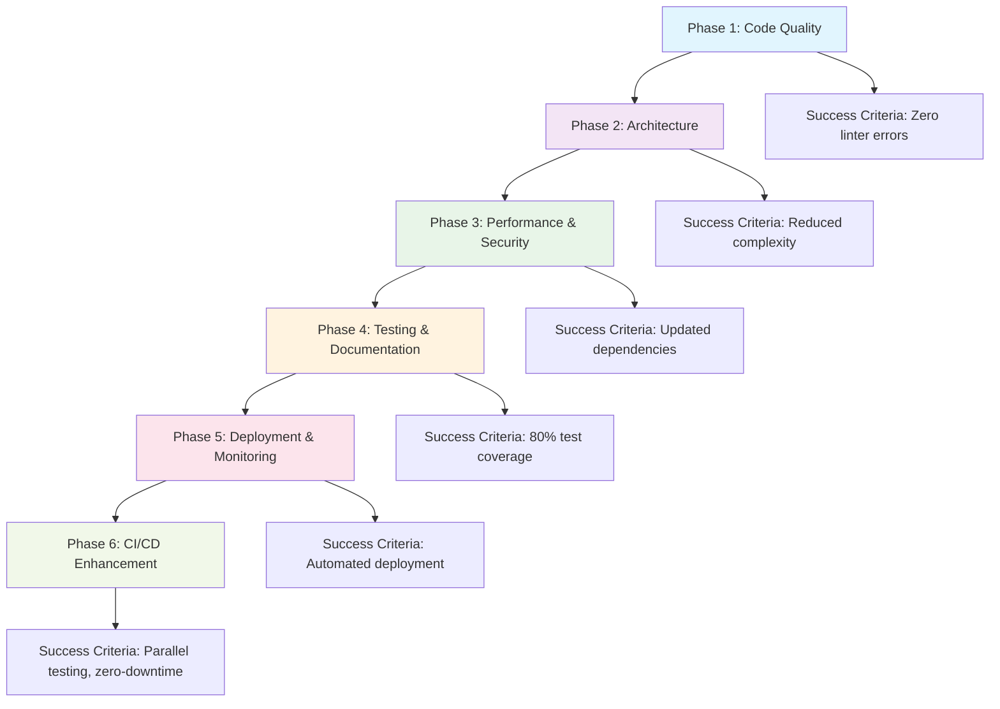

# CloudToLocalLLM Code Refactoring Plan

## Executive Summary

This comprehensive refactoring plan outlines a structured approach to improve the code quality, maintainability, performance, and security of the CloudToLocalLLM project. The project consists of a Flutter frontend, Node.js API backend, TypeScript SDK, and streaming proxy services. The refactoring will be conducted in five phases over multiple development cycles, prioritizing high-impact changes with manageable effort.

## Priority Matrix

| Priority | Impact | Effort | Areas |
|----------|--------|--------|-------|
| High | High | Low | Dependency updates, code formatting, basic security fixes |
| High | High | Medium | Architecture modularization, error handling improvements |
| Medium | High | High | Performance optimizations, comprehensive testing |
| Medium | Medium | Low | Documentation updates, code comments |
| Low | Medium | Medium | Advanced features, monitoring enhancements |

## Refactoring Workflow Overview

## Phase 1: Code Quality and Standards

### Objectives
- Establish consistent code standards
- Remove technical debt
- Improve readability and maintainability

### Action Items
- [ ] Implement automated linting and formatting across all codebases (ESLint for Node.js/TypeScript, flutter analyze for Dart)
- [ ] Remove unused imports and dead code
- [ ] Standardize naming conventions (PascalCase for classes, camelCase for variables)
- [ ] Add comprehensive code comments and documentation
- [ ] Fix all existing linter warnings and errors
- [ ] Implement pre-commit hooks for code quality checks

### Success Criteria
- Zero linter errors across all codebases
- Consistent code formatting
- Improved code readability scores

## Phase 2: Architecture Improvements

### Objectives
- Reduce coupling between components
- Improve dependency injection usage
- Modularize monolithic files

### Action Items
- [ ] Refactor main.dart to reduce direct service imports, rely more on DI locator
- [ ] Modularize server.js in API backend into separate concern files (config, middleware, routes)
- [ ] Implement proper separation of concerns in service classes
- [ ] Create shared interfaces for common patterns
- [ ] Improve error handling with centralized error management
- [ ] Implement proper async/await patterns throughout

### Success Criteria
- Reduced cyclomatic complexity in key files
- Improved testability through better separation of concerns
- Consistent error handling patterns

## Phase 3: Performance and Security

### Objectives
- Enhance application performance
- Strengthen security measures
- Update dependencies for latest features and patches

### Action Items
- [ ] Update all dependencies to latest stable versions (check pubspec.yaml, package.json files)
- [ ] Implement proper input validation and sanitization
- [ ] Add rate limiting and security headers
- [ ] Optimize database queries and connection pooling
- [ ] Implement caching strategies for frequently accessed data
- [ ] Add security audits and vulnerability scanning
- [ ] Improve memory management and resource cleanup

### Success Criteria
- Updated dependencies with no breaking changes
- Improved performance benchmarks
- Security audit passing with minimal vulnerabilities

## Phase 4: Testing and Documentation

### Objectives
- Increase test coverage
- Improve documentation quality
- Establish testing best practices

### Action Items
- [ ] Implement unit tests for all service classes
- [ ] Add integration tests for API endpoints
- [ ] Create widget tests for Flutter components
- [ ] Establish testing guidelines and standards
- [ ] Update inline code documentation
- [ ] Create comprehensive API documentation
- [ ] Add performance testing suites

### Success Criteria
- Minimum 80% test coverage across all codebases
- Updated and accurate documentation
- Automated testing in CI/CD pipeline

## Phase 5: Deployment and Monitoring

### Objectives
- Improve deployment processes
- Enhance monitoring and observability
- Streamline development workflows

### Action Items
- [ ] Implement automated deployment pipelines
- [ ] Add comprehensive logging and monitoring
- [ ] Create health check endpoints
- [ ] Implement feature flags for gradual rollouts
- [ ] Add performance monitoring and alerting
- [ ] Create rollback procedures and strategies
- [ ] Document deployment and maintenance procedures

### Success Criteria
- Automated deployment with zero-downtime capabilities
- Comprehensive monitoring dashboard
- Established incident response procedures

## Implementation Guidelines

### General Principles
- Follow existing code style guidelines from AGENTS.md
- Maintain backward compatibility where possible
- Implement changes incrementally with proper testing
- Use conventional commits for all changes
- Ensure all changes pass existing tests before merging

### Code Review Process
- All refactoring changes require code review
- Use pull requests with detailed descriptions
- Include before/after performance metrics where applicable
- Document any breaking changes clearly

### Risk Mitigation
- Create backups before major refactoring
- Implement feature flags for risky changes
- Have rollback plans for each phase
- Monitor application health during deployment
### Timeline Considerations
- Phase 1: 2-3 weeks (quick wins)
- Phase 2: 4-6 weeks (architectural changes)
- Phase 3: 3-4 weeks (dependency and security updates)
- Phase 4: 4-5 weeks (testing implementation)
- Phase 5: 3-4 weeks (deployment improvements)

### Success Metrics
- Improved code maintainability index
- Reduced bug reports and issues
- Faster development cycle times
- Better user experience and performance
- Enhanced security posture

This plan provides a roadmap for systematic improvement of the CloudToLocalLLM codebase while maintaining stability and functionality.