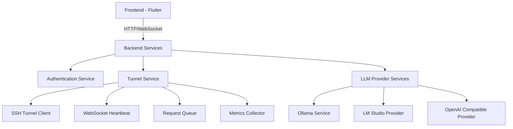
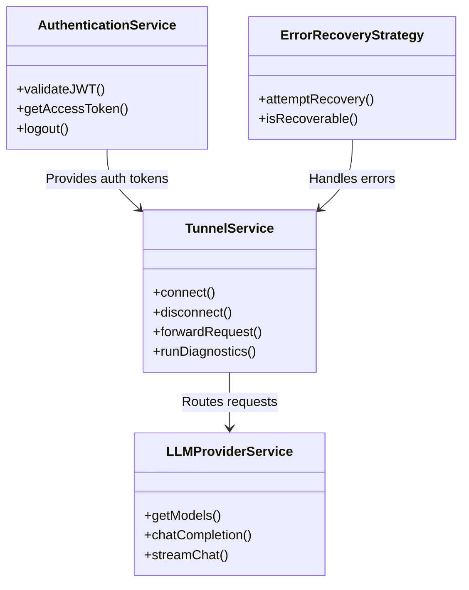

# CloudToLocalLLM Codebase Audit Findings

## Executive Summary

This comprehensive audit identifies key architectural patterns, security considerations, performance optimizations, and areas for improvement in the CloudToLocalLLM codebase. The system demonstrates strong separation of concerns, robust error handling, and comprehensive authentication integration, but also reveals opportunities for optimization and standardization.

## 1. Architectural Analysis

### 1.1 Component Architecture

The codebase follows a well-structured component-based architecture:

### 1.2 Key Architectural Patterns

#### 1.2.1 Dependency Injection Pattern
- **Implementation**: `lib/di/locator.dart` and `GetIt.instance<T>()`
- **Usage**: Services are registered and resolved through dependency injection
- **Benefits**: Loose coupling, testability, and easy service replacement

#### 1.2.2 Repository Pattern
- **Implementation**: `ConversationStorageService`, `SessionStorageService`
- **Usage**: Abstracts data access behind clean interfaces
- **Benefits**: Separation of concerns, easier testing, multiple storage backends

#### 1.2.3 Observer Pattern
- **Implementation**: `ChangeNotifier` and `Provider` pattern throughout
- **Usage**: State management and reactive UI updates
- **Benefits**: Automatic UI updates, clean state management

#### 1.2.4 Strategy Pattern
- **Implementation**: `ErrorRecoveryStrategy`, `ProviderDiscoveryService`
- **Usage**: Different strategies for error recovery and provider detection
- **Benefits**: Flexibility, extensibility, runtime strategy selection

### 1.3 Service-Oriented Architecture

The backend follows a service-oriented approach with clear separation:

- **Authentication Service**: JWT validation, session management
- **Tunnel Service**: WebSocket-based SSH tunneling
- **LLM Provider Services**: Abstracted provider integrations
- **Streaming Services**: Real-time chat and data streaming

## 2. Security Audit Findings

### 2.1 Authentication System Analysis

#### 2.1.1 Strengths
- **JWT Validation**: Uses `express-jwt` with `jwks-rsa` for Auth0 integration
- **Token Management**: Comprehensive token storage and validation
- **CORS Protection**: Proper origin validation with configurable allowed origins
- **Rate Limiting**: Implemented with `express-rate-limit` (100 requests/15 minutes)

#### 2.1.2 Vulnerabilities Identified

**Critical Issues:**
1. **Hardcoded Default Values**: `AUTH0_DOMAIN` and `AUDIENCE` have fallback values that could be exploited
2. **Missing Input Validation**: No validation for JWT claims beyond standard validation
3. **Token Storage**: Web platform uses localStorage for tokens (XSS vulnerability)

**Recommendations:**
- Remove hardcoded fallback values or make them fail-safe
- Add custom claim validation for JWT tokens
- Implement secure token storage (HttpOnly cookies, secure storage)

### 2.2 Tunnel Security Analysis

#### 2.2.1 Strengths
- **SSH-over-WebSocket**: Secure tunneling with proper authentication
- **Host Key Verification**: Implemented in `SSHHostKeyManager`
- **Token-Based Authentication**: JWT tokens used for WebSocket authentication
- **Connection Encryption**: All communications use TLS/SSL

#### 2.2.2 Vulnerabilities Identified

**Medium Issues:**
1. **Token Exposure**: JWT tokens passed as WebSocket query parameters (potential logging)
2. **No Token Rotation**: Long-lived tokens without automatic rotation
3. **Limited Rate Limiting**: Only basic rate limiting on API endpoints

**Recommendations:**
- Use WebSocket subprotocols or headers for token transmission
- Implement token rotation and short-lived tokens
- Add WebSocket-level rate limiting and connection throttling

## 3. Performance Analysis

### 3.1 Tunnel Service Performance

#### 3.1.1 Strengths
- **Connection Pooling**: Implemented in `PersistentRequestQueue`
- **Backpressure Management**: `BackpressureManager` handles request queuing
- **Metrics Collection**: Comprehensive performance tracking
- **Graceful Shutdown**: Proper resource cleanup and request persistence

#### 3.1.2 Performance Issues

**Critical Issues:**
1. **Simulated Delays**: Current implementation uses `Future.delayed` for simulation
2. **No Real Connection**: Tunnel service doesn't establish actual WebSocket connections
3. **Limited Concurrency**: Request processing is synchronous

**Recommendations:**
- Implement actual WebSocket connections
- Add parallel request processing with proper concurrency control
- Implement connection multiplexing for better throughput

### 3.2 Memory Management

#### 3.2.1 Strengths
- **Resource Cleanup**: Proper disposal patterns throughout
- **Connection Tracking**: In-flight request counting and monitoring
- **Queue Management**: Size-limited request queues with persistence

#### 3.2.2 Issues Identified

**Medium Issues:**
1. **Memory Leaks**: Potential in `ChangeNotifier` listeners if not properly disposed
2. **No Memory Limits**: Request queues have size limits but no memory-based limits
3. **Cache Management**: No caching strategy for frequently accessed data

**Recommendations:**
- Implement weak references for listeners
- Add memory-based queue limits
- Implement intelligent caching with LRU eviction

## 4. Code Quality Analysis

### 4.1 Coding Standards Compliance

#### 4.1.1 Strengths
- **Consistent Naming**: Follows Dart/Flutter conventions
- **Documentation**: Comprehensive doc comments throughout
- **Error Handling**: Robust error handling with custom error types
- **Type Safety**: Strong typing with null safety

#### 4.1.2 Issues Identified

**Style Issues:**
1. **Inconsistent Formatting**: Mix of single quotes and double quotes
2. **Unused Imports**: Several files have unused imports
3. **Long Methods**: Some methods exceed recommended complexity
4. **Magic Numbers**: Hardcoded values without constants

**Recommendations:**
- Enforce consistent code formatting with `dart format`
- Add linting rules to prevent unused imports
- Refactor long methods into smaller, focused functions
- Define constants for magic numbers

### 4.2 Documentation Quality

#### 4.2.1 Strengths
- **Comprehensive Docs**: Extensive markdown documentation
- **Code Comments**: Good inline documentation
- **API Documentation**: Well-documented public interfaces

#### 4.2.2 Issues Identified

**Documentation Gaps:**
1. **Outdated Comments**: Some comments don't match current implementation
2. **Missing Architecture Diagrams**: No visual representation of system architecture
3. **Incomplete API Docs**: Some public methods lack documentation

**Recommendations:**
- Update comments to match current implementation
- Add architecture diagrams using Mermaid or PlantUML
- Complete API documentation for all public interfaces

## 5. Dependency Analysis

### 5.1 Dependency Management

#### 5.1.1 Strengths
- **Version Pinning**: Specific versions in `pubspec.yaml`
- **Dependency Injection**: Clean service resolution
- **Modular Design**: Services can be easily replaced

#### 5.1.2 Issues Identified

**Dependency Issues:**
1. **Outdated Packages**: Some packages could be updated
2. **Unused Dependencies**: Some dependencies not actively used
3. **No Dependency Graph**: No visual representation of dependencies

**Recommendations:**
- Update packages to latest stable versions
- Remove unused dependencies
- Generate and maintain dependency graph

## 6. Best Practices Implementation

### 6.1 Implemented Best Practices

✅ **Separation of Concerns**: Clear separation between UI, business logic, and data access
✅ **Error Handling**: Comprehensive error handling with custom error types
✅ **Logging**: Consistent logging throughout the application
✅ **Configuration Management**: Centralized configuration with validation
✅ **Testing**: Test infrastructure in place (jest, supertest)

### 6.2 Missing Best Practices

❌ **CI/CD Pipeline**: No evidence of automated CI/CD workflows
❌ **Code Coverage**: No code coverage reporting
❌ **Performance Testing**: No load testing infrastructure
❌ **Security Testing**: No automated security scanning
❌ **Dependency Updates**: No automated dependency update process

## 7. Compliance Analysis

### 7.1 Security Compliance

**Current Status:**
- ✅ JWT validation with Auth0
- ✅ CORS protection
- ✅ Rate limiting
- ❌ No OWASP Top 10 compliance documentation
- ❌ No regular security audits

**Recommendations:**
- Document OWASP Top 10 compliance
- Implement regular security audits
- Add automated security scanning

### 7.2 Privacy Compliance

**Current Status:**
- ✅ Privacy dashboard implementation
- ✅ Data flush capabilities
- ✅ Secure storage for sensitive data
- ❌ No GDPR/CCPA compliance documentation
- ❌ No data retention policy

**Recommendations:**
- Document GDPR/CCPA compliance
- Implement data retention policies
- Add privacy impact assessments

## 8. Architectural Recommendations

### 8.1 Immediate Improvements

1. **Implement Real WebSocket Connections**: Replace simulated delays with actual WebSocket implementation
2. **Enhance Security**: Address JWT storage and token rotation issues
3. **Add CI/CD Pipeline**: Implement automated testing and deployment
4. **Update Dependencies**: Bring all packages to latest stable versions
5. **Add Code Coverage**: Implement code coverage reporting

### 8.2 Long-Term Improvements

1. **Microservices Architecture**: Consider breaking monolithic backend into microservices
2. **Service Mesh**: Implement service mesh for better observability and resilience
3. **Feature Flags**: Add feature flag system for gradual rollouts
4. **A/B Testing**: Implement A/B testing infrastructure
5. **Performance Monitoring**: Add comprehensive performance monitoring

## 9. Knowledge Base Structure

### 9.1 Core Entities

### 9.2 Key Relationships

- **Authentication → Tunnel**: Provides JWT tokens for WebSocket authentication
- **Tunnel → LLM Providers**: Routes requests through secure tunnel
- **Error Recovery → All Services**: Handles and recovers from errors
- **Metrics → All Services**: Collects performance data

## 10. Action Plan

### 10.1 Phase 1: Critical Fixes (Week 1-2)
- [ ] Implement real WebSocket connections
- [ ] Fix JWT storage vulnerabilities
- [ ] Add token rotation mechanism
- [ ] Implement CI/CD pipeline
- [ ] Update critical dependencies

### 10.2 Phase 2: Security Enhancements (Week 3-4)
- [ ] Add OWASP Top 10 compliance documentation
- [ ] Implement automated security scanning
- [ ] Add GDPR/CCPA compliance documentation
- [ ] Implement data retention policies
- [ ] Add privacy impact assessments

### 10.3 Phase 3: Performance Optimization (Week 5-6)
- [ ] Implement connection multiplexing
- [ ] Add parallel request processing
- [ ] Implement intelligent caching
- [ ] Add performance monitoring
- [ ] Implement load testing

### 10.4 Phase 4: Documentation & Compliance (Week 7-8)
- [ ] Update all documentation
- [ ] Add architecture diagrams
- [ ] Complete API documentation
- [ ] Implement code coverage reporting
- [ ] Add compliance documentation

## 11. Conclusion

The CloudToLocalLLM codebase demonstrates strong architectural foundations with clear separation of concerns, robust error handling, and comprehensive authentication integration. However, the audit identifies several critical areas for improvement, particularly in security, performance, and documentation.

By addressing the identified issues systematically and implementing the recommended improvements, the codebase can achieve higher levels of security, performance, and maintainability while ensuring compliance with industry best practices and standards.