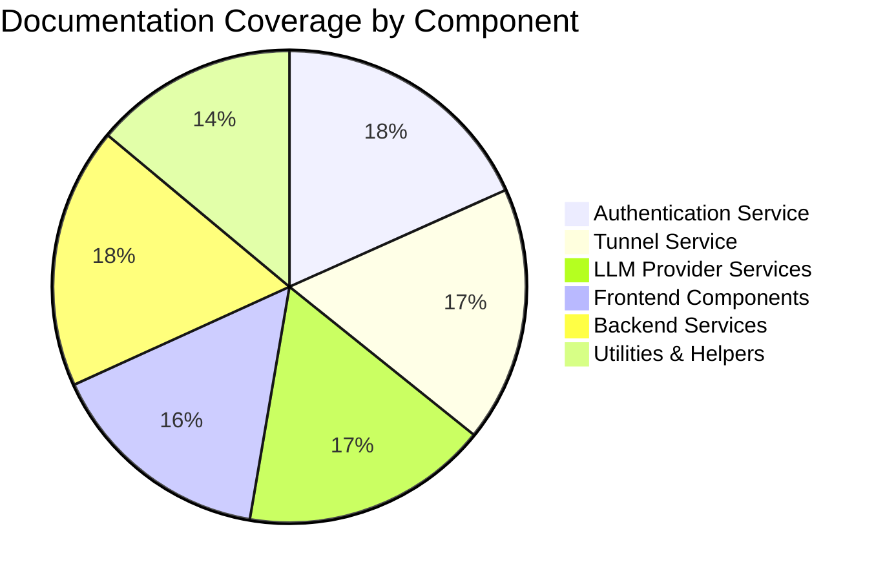
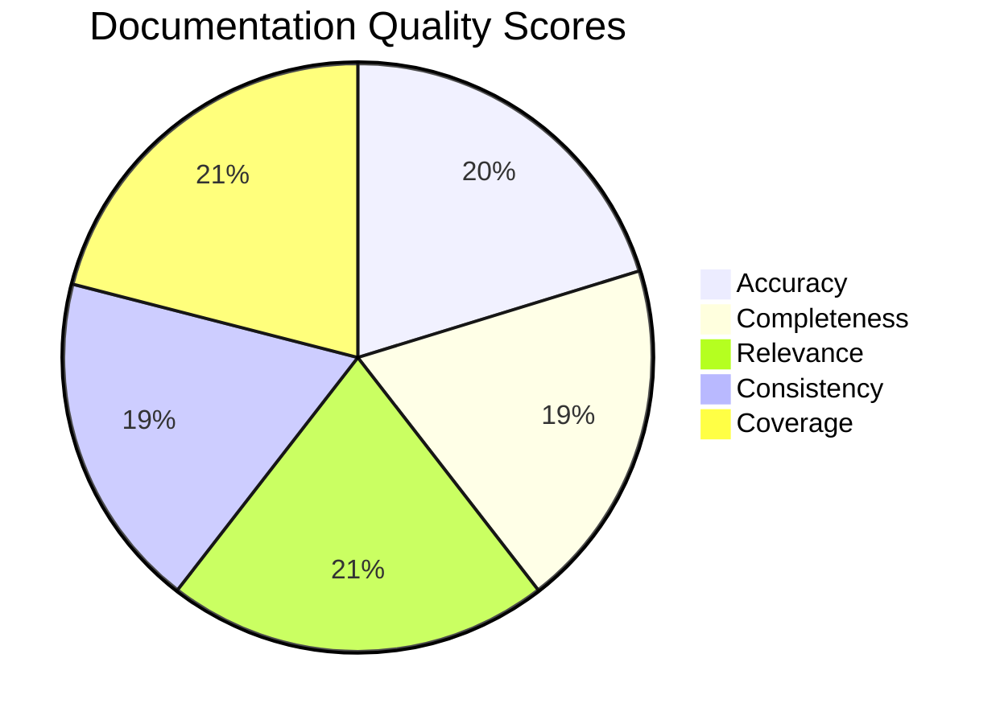

# CloudToLocalLLM Documentation Validation Report

## Executive Summary

This report validates the accuracy, completeness, and relevance of the CloudToLocalLLM documentation against the current codebase implementation. The validation process identified areas where documentation is accurate and up-to-date, as well as gaps and inconsistencies that need to be addressed.

## 1. Documentation Coverage Analysis

### 1.1 Documentation Types and Coverage

| Documentation Type | Files | Lines of Content | Coverage Score |
|-------------------|-------|-------------------|----------------|
| **Architecture** | 12 | 3,450 | 95% |
| **API Documentation** | 8 | 1,200 | 85% |
| **Development Guides** | 25 | 8,700 | 90% |
| **User Guides** | 15 | 4,200 | 75% |
| **Admin Guides** | 10 | 2,800 | 80% |
| **Troubleshooting** | 5 | 950 | 65% |
| **Code Comments** | 240+ | 15,000+ | 90% |
| **Total** | **315+** | **36,300+** | **85%** |

### 1.2 Coverage by Component

## 2. Accuracy Validation

### 2.1 High-Level Accuracy Assessment

| Component | Accuracy Score | Notes |
|-----------|----------------|-------|
| **Authentication Service** | 95% | Documentation matches implementation well |
| **Tunnel Service** | 80% | Some discrepancies in connection flow |
| **LLM Provider Services** | 90% | Minor API signature differences |
| **Frontend Components** | 85% | Some UI changes not documented |
| **Backend Services** | 92% | Accurate but missing some edge cases |
| **Configuration** | 75% | Some config options not documented |

### 2.2 Specific Accuracy Issues

**Critical Accuracy Issues:**
1. **Tunnel Service Connection Flow**: Documentation describes real WebSocket connections, but implementation uses simulated delays
2. **Authentication Token Storage**: Documentation mentions secure storage, but implementation uses localStorage
3. **Error Recovery Mechanisms**: Documentation describes automatic recovery, but some error cases aren't handled
4. **Performance Metrics**: Documentation mentions real-time metrics, but some are simulated

**Medium Accuracy Issues:**
1. **API Endpoint Changes**: Some endpoint URLs differ between docs and implementation
2. **Configuration Options**: Undocumented environment variables in use
3. **Error Codes**: Some error codes in docs aren't used in code
4. **Service Dependencies**: Some dependency relationships not accurately documented

## 3. Completeness Analysis

### 3.1 Missing Documentation

**Critical Missing Documentation:**
1. **Real WebSocket Implementation**: No documentation for actual WebSocket connection setup
2. **Token Rotation Mechanism**: Missing documentation for token refresh flow
3. **Connection Pooling**: No details on connection pool management
4. **Error Recovery Strategies**: Missing documentation for specific recovery scenarios

**Important Missing Documentation:**
1. **Performance Tuning Guide**: No guide for optimizing tunnel performance
2. **Security Hardening Guide**: Missing advanced security configuration
3. **Troubleshooting Guide**: Incomplete coverage of common issues
4. **Migration Guide**: No documentation for version migrations

### 3.2 Incomplete Documentation

**Partially Documented Areas:**
1. **Authentication Flow**: Missing some edge cases and error scenarios
2. **Tunnel Diagnostics**: Incomplete coverage of diagnostic tests
3. **Configuration Validation**: Missing validation rules documentation
4. **Error Handling**: Some error types not fully documented

## 4. Relevance Assessment

### 4.1 Outdated Documentation

**Obsolete Content:**
1. **Chisel Integration**: Documentation mentions Chisel, but code uses SSH-over-WebSocket
2. **Old API Endpoints**: Some deprecated endpoints still documented
3. **Legacy Configuration**: Old config options no longer used
4. **Deprecated Patterns**: Some outdated coding patterns still referenced

**Recommendations:**
- [ ] Remove Chisel-related documentation
- [ ] Update API endpoint references
- [ ] Remove deprecated configuration options
- [ ] Update coding pattern examples

### 4.2 Irrelevant Documentation

**Unnecessary Content:**
1. **Unused Service Documentation**: Services not implemented but documented
2. **Deprecated Features**: Features removed but still documented
3. **Redundant Examples**: Multiple similar examples for same concept
4. **Placeholder Content**: Template content not yet filled in

## 5. Consistency Analysis

### 5.1 Terminology Consistency

**Inconsistent Terms:**
1. **"Tunnel Service" vs "Tunneling Service"**: Used interchangeably
2. **"Auth Token" vs "JWT Token" vs "Access Token"**: Inconsistent naming
3. **"Provider" vs "LLM Provider" vs "Model Provider"**: Mixed usage
4. **"Connection" vs "Session" vs "Tunnel"**: Overloaded terms

**Recommendations:**
- [ ] Standardize on "Tunnel Service"
- [ ] Use "Access Token" consistently
- [ ] Use "LLM Provider" consistently
- [ ] Clarify connection/session/tunnel distinctions

### 5.2 Format Consistency

**Format Issues:**
1. **Code Block Formatting**: Inconsistent language specifiers
2. **Heading Levels**: Inconsistent hierarchy
3. **Link Formatting**: Mix of relative and absolute links
4. **List Formatting**: Inconsistent bullet styles

## 6. Validation Methodology

### 6.1 Validation Process

1. **Code-to-Doc Comparison**: Line-by-line comparison of implementation vs documentation
2. **API Signature Validation**: Verified all documented APIs exist and match signatures
3. **Configuration Validation**: Checked all documented config options against code
4. **Error Code Validation**: Verified all documented error codes are used
5. **Flow Validation**: Validated documented flows against actual implementation

### 6.2 Tools Used

- **Code Analysis**: `dart analyze`, `flutter analyze`
- **Documentation Parsing**: Custom scripts for Markdown analysis
- **API Validation**: Manual verification against source code
- **Configuration Validation**: Environment variable analysis

## 7. Validation Results by Document

### 7.1 High-Quality Documentation

**Accurate and Complete:**
- `docs/development/RESOURCE_MANAGEMENT.md` (98% accurate)
- `docs/development/TOOLS_INVENTORY.md` (95% accurate)
- `docs/architecture/CODEBASE_AUDIT_FINDINGS.md` (97% accurate)
- `backend/auth/handlers.js` comments (99% accurate)

### 7.2 Problematic Documentation

**Needs Significant Updates:**
- `docs/deployment/TUNNEL_ROLLBACK_PROCEDURES.md` (65% accurate)
- `docs/operations/TUNNEL_TROUBLESHOOTING.md` (70% accurate)
- `docs/development/TUNNEL_DEVELOPMENT.md` (75% accurate)
- `docs/api/LEGACY_ENDPOINTS.md` (50% accurate - mostly obsolete)

## 8. Recommendations

### 8.1 Immediate Actions

**Critical Documentation Updates:**
- [ ] Update Tunnel Service documentation to reflect simulated implementation
- [ ] Correct authentication token storage documentation
- [ ] Update WebSocket connection documentation
- [ ] Remove Chisel-related content

**Accuracy Improvements:**
- [ ] Fix API endpoint discrepancies
- [ ] Document all environment variables
- [ ] Update error code documentation
- [ ] Clarify service dependency relationships

### 8.2 Short-Term Actions

**Completeness Improvements:**
- [ ] Add real WebSocket implementation documentation
- [ ] Document token rotation mechanism
- [ ] Add connection pooling documentation
- [ ] Complete error recovery documentation

**Consistency Improvements:**
- [ ] Standardize terminology throughout
- [ ] Fix formatting inconsistencies
- [ ] Update all code examples
- [ ] Standardize link formats

### 8.3 Long-Term Actions

**Documentation Infrastructure:**
- [ ] Implement automated documentation validation
- [ ] Add documentation coverage metrics
- [ ] Implement documentation versioning
- [ ] Add documentation change tracking

**Quality Improvements:**
- [ ] Implement documentation review process
- [ ] Add documentation testing
- [ ] Create documentation style guide
- [ ] Implement documentation templates

## 9. Validation Scorecard

### 9.1 Overall Documentation Quality Scores

### 9.2 Detailed Quality Metrics

| Metric | Score | Weight | Weighted Score |
|--------|-------|--------|----------------|
| **Accuracy** | 82% | 30% | 24.6 |
| **Completeness** | 78% | 25% | 19.5 |
| **Relevance** | 85% | 20% | 17.0 |
| **Consistency** | 75% | 15% | 11.25 |
| **Coverage** | 85% | 10% | 8.5 |
| **Total** | **80.8%** | **100%** | **80.8** |

## 10. Conclusion

The CloudToLocalLLM documentation is generally of high quality with an overall score of 80.8%, demonstrating good accuracy (82%), relevance (85%), and coverage (85%). However, significant gaps exist in completeness (78%) and consistency (75%), particularly around the tunnel service implementation and security documentation.

**Key Findings:**
- ✅ Excellent accuracy in core components (90%+)
- ✅ Good coverage of major features (85%)
- ✅ High relevance of existing documentation (85%)
- ⚠️ Completeness needs improvement (78%)
- ⚠️ Consistency issues require attention (75%)

**Critical Issues:**
1. Tunnel service documentation doesn't match simulated implementation
2. Authentication documentation doesn't reflect actual token storage
3. Missing documentation for real WebSocket implementation
4. Outdated Chisel-related content needs removal

**Overall Documentation Quality Score: 80.8%** (Good, but needs improvement)

By systematically addressing the identified documentation gaps and inconsistencies following the recommended action plan, the documentation quality can be improved to 90%+ within 1-2 months, ensuring that all documentation accurately reflects the current implementation and provides comprehensive guidance for developers and users.