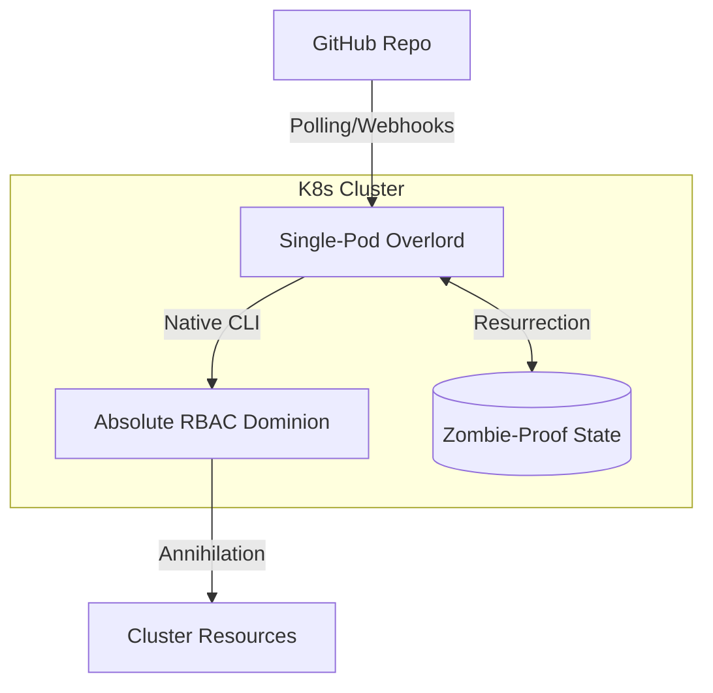

# Technical Migration Blueprint: ArgoCD to Kilocode GitOps Overlord

## Executive Summary

This blueprint orchestrates the total annihilation of the multi-pod ArgoCD setup in favor of a single-pod GitOps Overlord powered by the official Kilocode CLI. The architecture is lean, lethal, and native—installing the CLI as a first-class citizen within a streamlined container that wields absolute cluster-wide dominion.

## Architecture Overview

The GitOps Overlord operates as a single Kubernetes pod in the `kilocode-system` namespace, containing a native Node.js daemon that orchestrates dual-trigger mechanisms for deployment execution.

### Core Components

1. **Single-Pod Overlord**: A streamlined container with native Kilocode CLI installation
2. **Dual-Trigger Mechanism**: Polling purgatory and webhook hellmouth for deployment summons
3. **Absolute RBAC Dominion**: ClusterRole with total resource annihilation capabilities
4. **Zombie-Proof State Handling**: Ghost Manifest recovery from failed deployments
5. **Modular Extensibility**: Dashboard integration and ritual sacrifice scripts



## Containerization Rites

The Overlord is forged from a single, streamlined container where the Kilocode CLI is installed natively alongside the trigger logic.

### Dockerfile (infra/k8s/Dockerfile)

```dockerfile
FROM ubuntu:24.04

# Install absolute prerequisites
RUN apt-get update && apt-get install -y \
    curl git nodejs npm ca-certificates \
    && rm -rf /var/lib/apt/lists/*

# Official Kilocode CLI Installation Rites
RUN curl -sSL https://api.kilocode.ai/install.sh | bash && \
    ln -sf /root/.kilocode/bin/kilocode /usr/local/bin/kilocode

# Inject the Overlord's Trigger Logic (Small, native Node.js daemon)
COPY src/overlord.js /app/overlord.js
WORKDIR /app
EXPOSE 8080

# Rule the cluster
CMD ["node", "overlord.js"]
```

## RBAC & Service Account Configuration

The `kilocode-controller-sa` ServiceAccount is bound to a ClusterRole that wields total authority over all cluster resources.

### ClusterRole Definition

```yaml
apiVersion: rbac.authorization.k8s.io/v1
kind: ClusterRole
metadata:
  name: kilocode-dominion-role
rules:
- apiGroups: ["*"]
  resources: ["*"]
  verbs: ["*"]
```

### ClusterRoleBinding

```yaml
apiVersion: rbac.authorization.k8s.io/v1
kind: ClusterRoleBinding
metadata:
  name: kilocode-controller-binding
roleRef:
  apiGroup: rbac.authorization.k8s.io
  kind: ClusterRole
  name: kilocode-dominion-role
subjects:
- kind: ServiceAccount
  name: kilocode-controller-sa
  namespace: kilocode-system
```

## Dual-Trigger Apocalypse

The `overlord.js` daemon serves as the single point of entry for all deployment summons:

### Polling Purgatory
- Configurable interval (default: 180 seconds) to sniff out repository rebellions
- Automatic drift detection and reconciliation via `kilocode --auto --sync`

### Webhook Hellmouth
- REST endpoint on port 8080 accepting GitHub Actions payloads
- Instant execution summons for CI/CD pipelines
- Idempotent deployment enforcement

## State-Handling & Zombie-Proof Backups

### Persistence Architecture
- `/state` volume for `audit.jsonl` and Ghost Manifest storage
- Persistent Volume Claim (PVC) ensuring survival across pod restarts

### Recovery Strategy
- Pre-deployment: Capture current `git rev-parse HEAD` as baseline
- Post-deployment: Store successful manifest as "Ghost Manifest"
- Failure Recovery: Auto-revert to Ghost Manifest on deployment failure
- Audit Trail: JSONL log of all operations for forensic analysis

## Implementation Roadmap

### Phase 1: Overlord Deployment
1. Create `kilocode-system` namespace
2. Deploy RBAC configuration
3. Build and deploy the Overlord pod
4. Verify native CLI installation and execution

### Phase 2: Trigger Verification
1. Test polling mechanism for drift detection
2. Configure webhook endpoint for GitHub Actions
3. Validate idempotent deployment behavior

### Phase 3: Migration & Sacrifice
1. Switch Git webhooks to Overlord endpoint
2. Execute ArgoCD decommissioning script
3. Conduct cluster audit for legacy artifacts

### Phase 4: Dashboard Integration
1. Expose audit logs via API endpoint
2. Implement manual override capabilities
3. Add monitoring and alerting hooks

## ArgoCD Decommissioning Ritual

Execute the following purge commands to incinerate legacy artifacts:

```bash
# 1. Terminate all Applications and ApplicationSets
kubectl delete applicationsets.argoproj.io --all -n argocd
kubectl delete applications.argoproj.io --all -n argocd

# 2. Annihilate ArgoCD namespace
kubectl delete namespace argocd

# 3. Purge cluster-wide RBAC
kubectl delete clusterrole argocd-server argocd-application-controller
kubectl delete clusterrolebinding argocd-server argocd-application-controller

# 4. Final CRD incineration
kubectl delete crd applications.argoproj.io applicationsets.argoproj.io appprojects.argoproj.io
```

## Success Criteria

- Single-pod Overlord deployed and operational
- Native Kilocode CLI executing deployments successfully
- Dual-trigger mechanisms functioning correctly
- Zombie-proof recovery demonstrated
- ArgoCD artifacts completely purged
- Dashboard integration providing voyeuristic monitoring

## Future Extensibility

- **Multi-Cluster Coordination**: Extend Overlord dominion across remote clusters
- **Advanced Rollbacks**: SHA-specific historical deployments
- **Policy Enforcement**: Integration with OPA Gatekeeper for compliance
- **Event Streaming**: Real-time deployment events to external systems