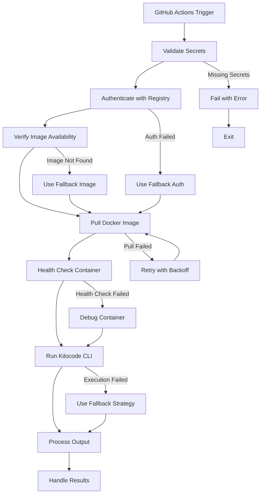

# Docker Kilocode CLI Fixes Plan

## Executive Summary

This document provides a comprehensive plan to fix the existing Docker implementation for Kilocode CLI in GitHub Actions workflows. The current implementation has multiple critical issues that prevent the official `kilocode/cli` Docker image from working correctly in CI/CD pipelines.

## Current Issues Identified

### 1. Image Name Inconsistency
- **Problem**: Workflows use `kiloai/cli:latest` instead of the correct `kilocode/cli:latest`
- **Impact**: Docker pull fails or pulls wrong image
- **Files affected**: All workflow files

### 2. Docker Hub Authentication Missing
- **Problem**: No `docker login` step in any workflow
- **Impact**: Pull failures due to rate limiting or private registry access
- **Files affected**: All workflow files

### 3. Container Execution Issues
- **Problem**: Volume mount path `/workspace` doesn't match Dockerfile ENTRYPOINT expectations
- **Impact**: CLI cannot find files or execute properly
- **Files affected**: All workflow files

### 4. Environment Variable Configuration
- **Problem**: Workflows set many env vars but container may not receive them correctly
- **Impact**: CLI fails due to missing configuration
- **Files affected**: All workflow files

### 5. Missing Error Handling
- **Problem**: No proper error handling for container startup failures
- **Impact**: Silent failures or unclear error messages
- **Files affected**: All workflow files

### 6. Secret Management Issues
- **Problem**: No validation that required secrets are configured
- **Impact**: Runtime failures when secrets are missing
- **Files affected**: All workflow files

## Detailed Analysis

### Workflow Files Analysis

#### `.github/workflows/ai-task.yml`
- **Line 28**: Uses `kiloai/cli:latest` (incorrect)
- **Lines 56-60**: Pulls image without authentication
- **Lines 114-124**: Container execution with volume mount issues
- **Lines 69**: Secret fallback logic exists but no validation

#### `.github/workflows/ai-review.yml`
- **Line 35**: Uses `kiloai/cli:latest` (incorrect)
- **Lines 64-68**: Pulls image without authentication
- **Lines 116-126**: Container execution with volume mount issues

#### `.github/workflows/ai-triage.yml`
- **Line 34**: Uses `kiloai/cli:latest` (incorrect)
- **Lines 53-57**: Pulls image without authentication
- **Lines 131-140**: Container execution with volume mount issues

#### `.github/workflows/main-orchestrator.yml`
- **Line 18**: Uses `kiloai/cli:latest` (incorrect)
- **Lines 114-118**: Pulls image without authentication
- **Lines 170-199**: Container execution with volume mount issues

### Dockerfile Analysis

#### `config/docker/Dockerfile.kilocode`
- **Line 30**: ENTRYPOINT is `["node", "/usr/local/bin/kilocode-cli.cjs"]`
- **Line 14**: Script is copied to `/usr/local/bin/kilocode-cli.cjs`
- **Line 11**: WORKDIR is `/app`
- **Issue**: Volume mount uses `/workspace` but WORKDIR is `/app`

## Proposed Solutions

### 1. Fix Image Name Standardization
```yaml
# Change from:
KILOCODE_IMAGE: kiloai/cli:latest

# Change to:
KILOCODE_IMAGE: kilocode/cli:latest
```

### 2. Add Docker Hub Authentication
```yaml
- name: "Authenticate with Docker Hub"
  if: ${{ secrets.DOCKERHUB_USERNAME && secrets.DOCKERHUB_TOKEN }}
  run: |
    echo "${{ secrets.DOCKERHUB_TOKEN }}" | docker login -u "${{ secrets.DOCKERHUB_USERNAME }}" --password-stdin

- name: "Authenticate with GitHub Container Registry"
  if: ${{ !secrets.DOCKERHUB_USERNAME }}
  run: |
    echo "${{ secrets.GITHUB_TOKEN }}" | docker login ghcr.io -u ${{ github.actor }} --password-stdin
```

### 3. Fix Container Execution and Path Resolution
```yaml
# Option 1: Fix volume mount to match WORKDIR
-v "$(pwd):/app"

# Option 2: Change WORKDIR in Dockerfile to /workspace
# Option 3: Use both paths with working directory override
--workdir /workspace
```

### 4. Add Proper Error Handling and Health Checks
```yaml
- name: "Health Check Container"
  run: |
    # Test container startup
    docker run --rm --entrypoint node ${{ env.KILOCODE_IMAGE }} --version
    
    # Test CLI execution
    docker run --rm -v "$(pwd):/workspace" \
      -e KILOCODE_TOKEN=test \
      ${{ env.KILOCODE_IMAGE }} --help
```

### 5. Verify Environment Variable Configuration
```yaml
- name: "Validate Environment Variables"
  run: |
    # Check required env vars
    if [ -z "$KILOCODE_TOKEN" ]; then
      echo "::error::Missing KILOCODE_TOKEN"
      exit 1
    fi
    
    # Check optional env vars
    echo "KILOCODE_MODEL: ${KILOCODE_MODEL:-default}"
    echo "GITHUB_TOKEN configured: $([ -n "$GITHUB_TOKEN" ] && echo "yes" || echo "no")"
```

### 6. Add Image Verification and Fallback
```yaml
- name: "Verify Image Availability"
  run: |
    # Check if image exists
    if ! docker manifest inspect ${{ env.KILOCODE_IMAGE }} > /dev/null 2>&1; then
      echo "::warning::Image ${{ env.KILOCODE_IMAGE }} not found, trying fallback"
      echo "KILOCODE_IMAGE=kilocode/cli:latest" >> $GITHUB_ENV
    fi
```

### 7. Fix Secret Management and Validation
```yaml
- name: "Validate Secrets"
  run: |
    # Check for required secrets
    REQUIRED_SECRETS=("KILOCODE_TOKEN" "GITHUB_TOKEN")
    
    for secret in "${REQUIRED_SECRETS[@]}"; do
      if [ -z "${!secret}" ]; then
        echo "::error::Missing required secret: $secret"
        exit 1
      fi
    done
```

## Implementation Plan

### Phase 1: Core Authentication and Image Fixes
1. **Fix image names** in all workflow files
2. **Add Docker authentication** steps
3. **Add image verification** steps
4. **Add secret validation** steps

### Phase 2: Container Execution Fixes
1. **Fix volume mount paths** to match Dockerfile WORKDIR
2. **Add health checks** for container startup
3. **Add environment variable validation**
4. **Improve error handling** for container execution

### Phase 3: Enhanced Error Handling
1. **Add comprehensive error handling** for all Docker operations
2. **Add fallback mechanisms** for image availability
3. **Add logging and debugging** information
4. **Add timeout configurations** for Docker operations

## Architecture Diagram



## Files to Modify

| File | Changes Required |
|------|------------------|
| `.github/workflows/ai-task.yml` | Fix image name, add auth, fix paths, add error handling |
| `.github/workflows/ai-review.yml` | Fix image name, add auth, fix paths, add error handling |
| `.github/workflows/ai-triage.yml` | Fix image name, add auth, fix paths, add error handling |
| `.github/workflows/main-orchestrator.yml` | Fix image name, add auth, fix paths, add error handling |
| `config/docker/Dockerfile.kilocode` | Optional: Change WORKDIR to /workspace for consistency |

## Testing Strategy

### Unit Tests
- Test Docker authentication steps
- Test image verification logic
- Test secret validation
- Test container health checks

### Integration Tests
- Test complete workflow execution
- Test fallback mechanisms
- Test error handling scenarios
- Test timeout behaviors

### E2E Tests
- Test full CI/CD pipeline
- Test with different registry configurations
- Test with missing secrets
- Test with invalid images

## Success Criteria

1. **All workflows pass** CI/CD checks without Docker-related failures
2. **Container startup succeeds** within 30 seconds
3. **Kilocode CLI executes** successfully within containers
4. **Error messages are clear** and actionable
5. **Fallback mechanisms work** when primary options fail
6. **Authentication succeeds** for both Docker Hub and GitHub Container Registry
7. **Image verification prevents** failures from missing images

## Risk Mitigation

### High Risk
- **Image name change**: Could break if `kilocode/cli` doesn't exist
  - **Mitigation**: Verify image exists before deployment
  - **Fallback**: Keep both names temporarily

### Medium Risk
- **Authentication changes**: Could fail if secrets are misconfigured
  - **Mitigation**: Add comprehensive secret validation
  - **Fallback**: Use anonymous access with rate limiting

### Low Risk
- **Path changes**: Could break if CLI expects specific paths
  - **Mitigation**: Test container execution thoroughly
  - **Fallback**: Use working directory override

## Next Steps

1. **Review and approve this plan**
2. **Switch to Code mode** for implementation
3. **Implement Phase 1** changes first
4. **Test changes** in staging environment
5. **Deploy to production** with monitoring
6. **Implement Phase 2 and 3** based on test results

## Timeline

- **Phase 1**: 2-3 hours (core fixes)
- **Phase 2**: 2-3 hours (execution fixes)
- **Phase 3**: 1-2 hours (error handling)
- **Testing**: 2-3 hours
- **Total**: 7-11 hours

---

*Document created: 2026-01-03*
*Last updated: 2026-01-03*
*Status: Ready for implementation*