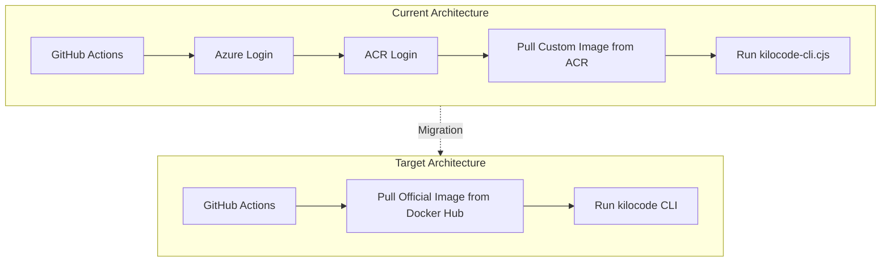

# Docker Kilocode CLI Migration Plan

## Overview

This plan outlines the migration from a custom ACR-hosted Kilocode CLI Docker image to the official `kilocode/cli` Docker image from Docker Hub.

## Current State Analysis

### Custom Implementation Issues

1. **Custom Dockerfile** at [`config/docker/Dockerfile.kilocode`](../config/docker/Dockerfile.kilocode:1)
   - Uses local [`scripts/kilocode-cli.cjs`](../scripts/kilocode-cli.cjs:1) script
   - Builds custom image pushed to Azure Container Registry (ACR)
   - Requires ACR authentication in every workflow

2. **Affected Workflows**:
   - [`build-kilocode-image.yml`](../.github/workflows/build-kilocode-image.yml:1) - Builds custom image
   - [`main-orchestrator.yml`](../.github/workflows/main-orchestrator.yml:1) - Uses ACR image
   - [`ai-triage.yml`](../.github/workflows/ai-triage.yml:1) - Uses ACR image
   - [`ai-task.yml`](../.github/workflows/ai-task.yml:1) - Uses ACR image
   - [`ai-review.yml`](../.github/workflows/ai-review.yml:1) - Uses ACR image
   - [`ai-scheduled-triage.yml`](../.github/workflows/ai-scheduled-triage.yml:1) - Uses ACR image

3. **Current Image Reference**:
   ```
   imrightguycloudtolocalllm.azurecr.io/kilocode-cli:latest
   ```

## Target State

### Official Kilocode CLI Docker Image

The official image is available at:
```
kilocode/cli:latest
```

### Environment Variables (Official CLI)

Based on the official documentation:

| Variable | Description | Required |
|----------|-------------|----------|
| `KILO_PROVIDER_TYPE` | Provider type (e.g., `kilocode`) | Yes |
| `KILOCODE_TOKEN` | API authentication token | Yes |
| `KILOCODE_MODEL` | Model to use (e.g., `x-ai/grok-code-fast-1`) | Yes |
| `KILO_MODE` | Operation mode (e.g., `code`) | Optional |
| `KILO_TELEMETRY` | Enable/disable telemetry (`true`/`false`) | Optional |
| `KILO_THEME` | UI theme (`dark`/`light`) | Optional |
| `KILO_AUTO_APPROVAL_ENABLED` | Enable auto-approval | Optional |
| `KILO_AUTO_APPROVAL_READ_ENABLED` | Auto-approve read operations | Optional |
| `KILO_AUTO_APPROVAL_WRITE_ENABLED` | Auto-approve write operations | Optional |
| `KILO_AUTO_APPROVAL_EXECUTE_ENABLED` | Auto-approve execute operations | Optional |
| `KILO_AUTO_APPROVAL_EXECUTE_ALLOWED` | Allowed commands for auto-execute | Optional |

### Docker Run Command Pattern

```bash
docker run -it --rm \
  -e KILO_PROVIDER_TYPE=kilocode \
  -e KILOCODE_TOKEN=${KILOCODE_TOKEN} \
  -e KILOCODE_MODEL=x-ai/grok-code-fast-1 \
  -e KILO_MODE=code \
  -e KILO_TELEMETRY=false \
  -e KILO_AUTO_APPROVAL_ENABLED=true \
  -v $(pwd):/workspace \
  kilocode/cli \
  kilocode --auto "Your prompt here"
```

## Migration Steps

### Step 1: Deprecate Custom Image Build

**File**: `.github/workflows/build-kilocode-image.yml`

**Action**: Either delete or disable this workflow since we no longer need to build a custom image.

**Option A - Delete**: Remove the file entirely
**Option B - Disable**: Add `if: false` to prevent execution while keeping for reference

### Step 2: Update main-orchestrator.yml

**Changes Required**:

1. Remove Azure ACR login step (lines 127-132)
2. Remove Docker pull step for ACR image (lines 134-139)
3. Update `IMAGE_TAG` variable from ACR to official image
4. Update environment variables to match official CLI format
5. Update docker run command syntax

**Before**:
```yaml
- name: "Log in to Azure Container Registry"
  uses: azure/docker-login@v2
  with:
    login-server: imrightguycloudtolocalllm.azurecr.io
    username: ${{ secrets.ACR_USERNAME }}
    password: ${{ secrets.ACR_PASSWORD }}

- name: "Pull Kilocode Image"
  uses: nick-fields/retry@v3
  with:
    timeout_minutes: 5
    max_attempts: 3
    command: docker pull imrightguycloudtolocalllm.azurecr.io/kilocode-cli:latest
```

**After**:
```yaml
- name: "Pull Official Kilocode CLI Image"
  run: docker pull kilocode/cli:latest
```

**Docker Run Before**:
```bash
docker run --rm -v "$(pwd):/app" -w /app \
  -e KILOCODE_TOKEN \
  -e KILOCODE_MODEL \
  -e KILOCODE_POSTHOG_API_KEY \
  "$IMAGE_TAG" "prompt"
```

**Docker Run After**:
```bash
docker run --rm -v "$(pwd):/workspace" \
  -e KILO_PROVIDER_TYPE=kilocode \
  -e KILOCODE_TOKEN \
  -e KILOCODE_MODEL \
  -e KILO_TELEMETRY=false \
  -e KILO_AUTO_APPROVAL_ENABLED=true \
  kilocode/cli:latest \
  kilocode --auto "prompt"
```

### Step 3: Update ai-triage.yml

**Changes Required**:
1. Remove Azure login step (lines 51-57)
2. Remove ACR login step (lines 59-64)
3. Update IMAGE_TAG to `kilocode/cli:latest`
4. Update docker run command with official CLI syntax
5. Remove kilocode.config.json creation (not needed with env vars)

### Step 4: Update ai-task.yml

**Changes Required**:
1. Remove cache step referencing `scripts/kilocode-cli.cjs` (lines 40-46)
2. Remove Azure login step (lines 60-66)
3. Remove ACR login step (lines 68-73)
4. Update IMAGE_TAG to `kilocode/cli:latest`
5. Update docker run command with official CLI syntax
6. Remove kilocode.config.json creation

### Step 5: Update ai-review.yml

**Changes Required**:
1. Remove Azure login step (lines 62-68)
2. Remove ACR login step (lines 70-75)
3. Update IMAGE_TAG to `kilocode/cli:latest`
4. Update docker run command with official CLI syntax
5. Remove kilocode.config.json creation

### Step 6: Update ai-scheduled-triage.yml

**Changes Required**:
1. Remove ACR login step (lines 46-51)
2. Remove cache step referencing `scripts/kilocode-cli.cjs` (lines 53-59)
3. Update IMAGE_TAG to `kilocode/cli:latest`
4. Update docker run command with official CLI syntax
5. Remove ~/.kilocode/config.json creation

## Workflow Template

Here's a standardized template for running the official Kilocode CLI:

```yaml
- name: "Run Kilocode Analysis"
  env:
    KILOCODE_TOKEN: ${{ secrets.KILOCODE_TOKEN }}
    KILOCODE_MODEL: "x-ai/grok-code-fast-1"
  run: |
    MAX_RETRIES=3
    RETRY_COUNT=0
    SUCCESS=false
    
    while [ $RETRY_COUNT -lt $MAX_RETRIES ]; do
      echo "Attempt $((RETRY_COUNT + 1)) of $MAX_RETRIES..."
      if timeout 300 docker run --rm \
        -v "$(pwd):/workspace" \
        -e KILO_PROVIDER_TYPE=kilocode \
        -e KILOCODE_TOKEN \
        -e KILOCODE_MODEL \
        -e KILO_TELEMETRY=false \
        -e KILO_AUTO_APPROVAL_ENABLED=true \
        kilocode/cli:latest \
        kilocode --auto "$PROMPT" > raw_output.json 2> ai_error.log; then
        SUCCESS=true
        break
      else
        echo "::warning::Attempt $((RETRY_COUNT + 1)) failed"
        cat ai_error.log
        RETRY_COUNT=$((RETRY_COUNT + 1))
        [ $RETRY_COUNT -lt $MAX_RETRIES ] && sleep 15
      fi
    done
    
    if [ "$SUCCESS" = false ]; then
      echo "::error::Kilocode CLI failed after $MAX_RETRIES attempts"
      exit 1
    fi
```

## Files to Clean Up

After migration, consider removing or archiving:

1. `config/docker/Dockerfile.kilocode` - No longer needed
2. `scripts/kilocode-cli.cjs` - No longer needed for Docker (may keep for local dev)
3. `.github/workflows/build-kilocode-image.yml` - No longer needed

## Secrets to Keep

The following secrets are still required:
- `KILOCODE_TOKEN` - API authentication token
- `KILOCODE_POSTHOG_API_KEY` - Optional, for analytics

## Secrets No Longer Required for Kilocode

These ACR-related secrets are no longer needed for Kilocode CLI:
- `ACR_REGISTRY`
- `ACR_USERNAME`
- `ACR_PASSWORD`

**Note**: These may still be needed for other Docker images in the project.

## Testing Plan

1. Create a test branch with all workflow changes
2. Trigger each workflow manually via `workflow_dispatch`
3. Verify Docker image pulls successfully
4. Verify Kilocode CLI executes and returns valid responses
5. Check that environment variables are properly passed
6. Validate JSON output parsing works correctly

## Rollback Plan

If issues occur:
1. Revert workflow changes to use ACR image
2. Ensure `build-kilocode-image.yml` is re-enabled
3. Verify ACR credentials are still valid

## Architecture Diagram



## Implementation Order

1. **Phase 1**: Update `main-orchestrator.yml` first as it's the primary workflow
2. **Phase 2**: Update AI workflows in order:
   - `ai-triage.yml`
   - `ai-review.yml`
   - `ai-task.yml`
   - `ai-scheduled-triage.yml`
3. **Phase 3**: Disable/remove `build-kilocode-image.yml`
4. **Phase 4**: Clean up unused files

## Success Criteria

- [ ] All workflows execute without ACR authentication errors
- [ ] Official `kilocode/cli` image pulls successfully
- [ ] Kilocode CLI returns valid JSON responses
- [ ] No regression in AI analysis functionality
- [ ] Reduced workflow complexity and dependencies
