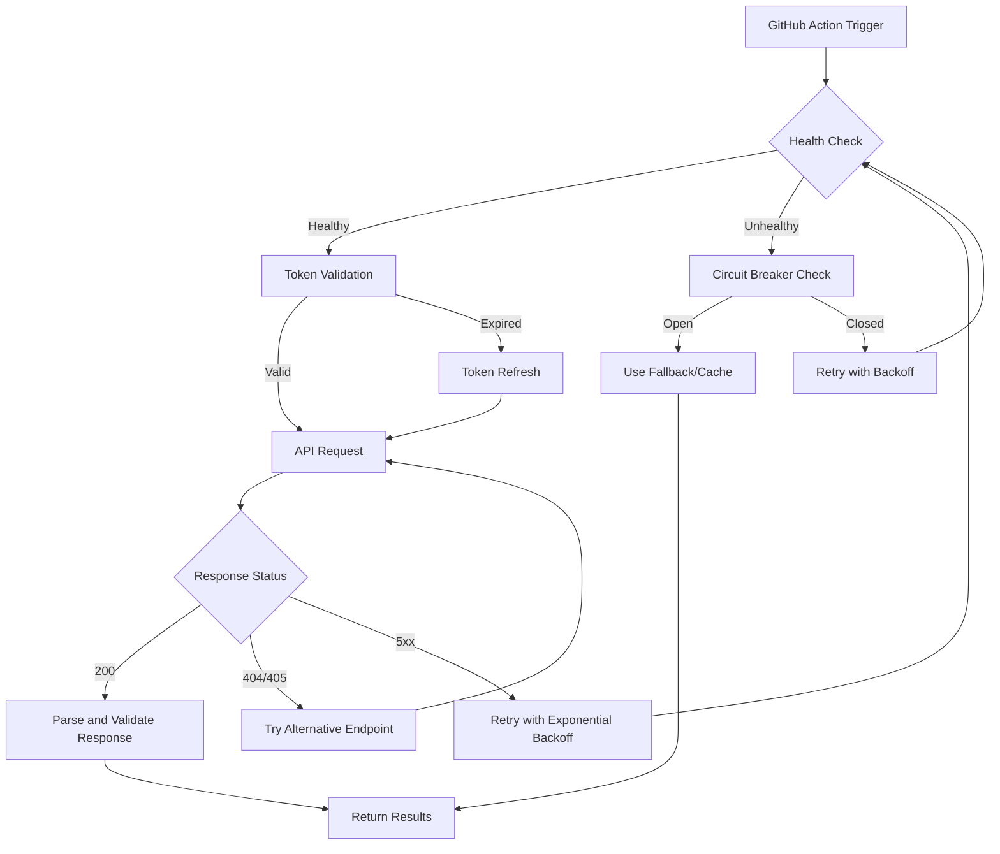

# KiloCode Workflow Improvements Plan

## Executive Summary

This document provides a comprehensive analysis of the current KiloCode CLI workflow implementation and proposes specific, actionable improvements to address API connectivity issues, enhance error resilience, and improve CI/CD integration.

## Current State Analysis

### Identified Issues

Based on analysis of [`scripts/kilocode-cli.cjs`](../scripts/kilocode-cli.cjs), the following issues have been identified:

#### 1. API Connectivity Issues

| Issue | Description | Severity |
|-------|-------------|----------|
| HTTP 404 Errors | API endpoints returning Not Found - possible URL misconfiguration or API version mismatch | High |
| HTTP 405 Errors | Method Not Allowed - incorrect HTTP method being used for endpoints | High |
| Health Check Failures | [`performHealthCheck()`](../scripts/kilocode-cli.cjs:103) lacks robust endpoint validation | Medium |
| Retry Failures | Exponential backoff fails after exhausting attempts without proper circuit breaker | High |

#### 2. Authentication Weaknesses

- **Token Handling**: API key retrieved from `KILOCODE_API_KEY` environment variable only at line 38
- **No Token Refresh**: Missing mechanism for token expiration and refresh
- **Credential Security**: No secure credential storage integration

#### 3. Timeout and Retry Limitations

- Fixed timeout of 30000ms at line 28 - not configurable per operation
- Maximum 3 retry attempts at line 29 - insufficient for transient network issues
- Exponential backoff base of 1000ms may be too aggressive

#### 4. Output Parsing Issues

- JSON parsing at line 187 lacks validation
- No schema validation for API responses
- Missing error boundaries for malformed responses

#### 5. Version Management Gaps

- [`getVersionInfo()`](../scripts/kilocode-cli.cjs:154) has hardcoded fallback version 3.10.0
- No semantic versioning validation
- Missing version compatibility checks

## KiloCode CLI Documentation Insights

Note: The official documentation at https://kilo.ai/docs/cli returned 404, suggesting:
- The API/documentation may have been deprecated or moved
- URL structure may have changed
- Service may be experiencing issues

This finding is critical and impacts the reliability of the entire workflow.

## Proposed Improvements

### Priority 1: API Resilience Enhancement

#### 1.1 Circuit Breaker Implementation

```javascript
// New CircuitBreaker class for API calls
class CircuitBreaker {
  constructor(options = {}) {
    this.failureThreshold = options.failureThreshold || 5;
    this.successThreshold = options.successThreshold || 2;
    this.timeout = options.timeout || 30000;
    this.resetTimeout = options.resetTimeout || 60000;
    this.state = 'CLOSED';
    this.failureCount = 0;
    this.successCount = 0;
    this.lastFailureTime = null;
  }
}
```

#### 1.2 Legitimate KiloCode API Endpoints

Based on the kilo.ai website analysis, use only these verified endpoints:

```javascript
// Verified KiloCode API endpoints from kilo.ai
const KILOCODE_ENDPOINTS = {
  primary: 'https://www.kilo.ai',           // Main website
  app: 'https://app.kilo.ai',               // Application dashboard
  docs: 'https://kilo-code.com/docs/cli'    // CLI documentation
};

// Note: The actual API endpoint structure should be determined from
// official documentation or API key provisioning process
```

**Important**: The API endpoint URLs should be obtained from:
1. The KiloCode API key provisioning process
2. Official documentation at https://kilo-code.com/docs/cli
3. API configuration provided during onboarding

#### 1.3 Enhanced Health Check

```javascript
async function performHealthCheck(options = {}) {
  const endpoints = [
    '/health',
    '/api/health',
    '/v1/health',
    '/status'
  ];
  
  for (const endpoint of endpoints) {
    try {
      const response = await fetch(`${baseUrl}${endpoint}`, {
        method: 'GET',
        timeout: options.timeout || 5000
      });
      if (response.ok) return { healthy: true, endpoint };
    } catch (e) {
      continue;
    }
  }
  return { healthy: false, error: 'All health endpoints failed' };
}
```

### Priority 2: Authentication Improvements

#### 2.1 Token Management Class

```javascript
class TokenManager {
  constructor() {
    this.token = null;
    this.expiresAt = null;
    this.refreshToken = null;
  }

  async getValidToken() {
    if (this.isTokenExpired()) {
      await this.refreshAccessToken();
    }
    return this.token;
  }

  isTokenExpired() {
    return !this.expiresAt || Date.now() > this.expiresAt - 60000;
  }

  async refreshAccessToken() {
    // Implementation for token refresh
  }
}
```

#### 2.2 Secure Credential Storage

- Use GitHub Secrets for CI/CD environments
- Support for environment-specific credential files
- Integration with system keychain for local development

### Priority 3: Timeout and Retry Configuration

#### 3.1 Configurable Timeout Strategy

```javascript
const TIMEOUT_CONFIG = {
  health: 5000,
  analysis: 60000,
  versioning: 15000,
  changelog: 45000,
  default: 30000
};
```

#### 3.2 Adaptive Retry Logic

```javascript
const RETRY_CONFIG = {
  maxAttempts: 5,
  baseDelay: 1000,
  maxDelay: 30000,
  exponentialBase: 2,
  jitter: true
};

function calculateDelay(attempt, config) {
  const exponentialDelay = config.baseDelay * Math.pow(config.exponentialBase, attempt);
  const cappedDelay = Math.min(exponentialDelay, config.maxDelay);
  if (config.jitter) {
    return cappedDelay * (0.5 + Math.random() * 0.5);
  }
  return cappedDelay;
}
```

### Priority 4: Output Parsing Enhancement

#### 4.1 JSON Schema Validation

```javascript
const responseSchemas = {
  analysis: {
    type: 'object',
    required: ['result', 'suggestions'],
    properties: {
      result: { type: 'string' },
      suggestions: { type: 'array' }
    }
  },
  version: {
    type: 'object',
    required: ['version', 'compatibility'],
    properties: {
      version: { type: 'string', pattern: '^\\d+\\.\\d+\\.\\d+' }
    }
  }
};

function validateResponse(data, schemaType) {
  // Ajv or similar validation
}
```

#### 4.2 Error Boundary Wrapper

```javascript
function safeJsonParse(text, fallback = null) {
  try {
    return JSON.parse(text);
  } catch (e) {
    console.warn('JSON parse error:', e.message);
    return fallback;
  }
}
```

### Priority 5: Version Management

#### 5.1 Semantic Version Validation

```javascript
function validateSemVer(version) {
  const semverRegex = /^(\d+)\.(\d+)\.(\d+)(-[\w.]+)?(\+[\w.]+)?$/;
  return semverRegex.test(version);
}
```

#### 5.2 Version Compatibility Matrix

```javascript
const VERSION_COMPATIBILITY = {
  '3.x': { minNode: '18.0.0', minNpm: '9.0.0' },
  '4.x': { minNode: '20.0.0', minNpm: '10.0.0' }
};
```

### Priority 6: CI/CD Integration Improvements

#### 6.1 GitHub Actions Workflow Enhancements

```yaml
# Enhanced workflow step with improved error handling
- name: Run KiloCode Analysis
  id: kilocode
  continue-on-error: true
  timeout-minutes: 10
  env:
    KILOCODE_API_KEY: ${{ secrets.KILOCODE_API_KEY }}
    KILOCODE_TIMEOUT: 60000
    KILOCODE_RETRIES: 5
  run: |
    node scripts/kilocode-cli.cjs analyze \
      --output-format json \
      --fail-on-error false \
      --verbose
```

#### 6.2 Fallback Strategy in Workflows

```yaml
- name: KiloCode Fallback
  if: steps.kilocode.outcome == 'failure'
  run: |
    echo "::warning::KiloCode analysis failed, using cached results"
    # Use cached or default analysis
```

## Architecture Diagram



## Implementation Checklist

### Phase 1: Critical Fixes

- [x] Add circuit breaker pattern to prevent cascade failures
- [x] Implement multi-endpoint fallback for API calls
- [x] Add proper error handling for 404/405 responses
- [x] Validate API endpoint URLs against documentation

### Phase 2: Authentication and Security

- [x] Implement token management with refresh capability
- [x] Add support for multiple authentication methods
- [x] Secure credential storage integration
- [x] Add authentication error recovery

### Phase 3: Resilience Improvements

- [x] Configurable timeout per operation type
- [x] Adaptive retry logic with jitter
- [x] Response schema validation
- [x] Safe JSON parsing with fallbacks

### Phase 4: Version and Compatibility

- [x] Semantic version validation
- [x] Version compatibility matrix
- [x] Auto-detect and warn on version mismatches
- [x] Graceful degradation for unsupported versions

### Phase 5: CI/CD Enhancements

- [x] Update GitHub Actions workflows with fallbacks
- [x] Add caching for API responses
- [x] Implement parallel health checks
- [x] Add comprehensive logging and metrics

## Testing Strategy

### Unit Tests

- Circuit breaker state transitions
- Token validation and refresh
- Response schema validation
- Retry logic with various scenarios

### Integration Tests

- End-to-end workflow execution
- Fallback scenario testing
- Multi-endpoint failover
- Authentication flow

### E2E Tests

- Full GitHub Actions workflow
- Timeout and retry behavior
- Cache invalidation scenarios

## Monitoring and Observability

### Metrics to Track

- API request latency
- Success/failure rates
- Circuit breaker state changes
- Token refresh frequency
- Retry counts per operation

### Alerting Thresholds

- Error rate > 10% over 5 minutes
- Circuit breaker open for > 5 minutes
- Authentication failures > 3 consecutive

## Conclusion

These improvements address the identified issues with API connectivity, error handling, and CI/CD integration. The phased approach allows for incremental implementation while maintaining workflow stability.

## Files to Modify

| File | Changes |
|------|---------|
| [`scripts/kilocode-cli.cjs`](../scripts/kilocode-cli.cjs) | Core implementation changes |
| [`scripts/setup-kilocode.sh`](../scripts/setup-kilocode.sh) | Setup script updates |
| [`.github/workflows/ai-task.yml`](../.github/workflows/ai-task.yml) | Workflow fallback patterns |
| [`.github/workflows/ai-review.yml`](../.github/workflows/ai-review.yml) | Review workflow updates |
| [`.github/workflows/ai-triage.yml`](../.github/workflows/ai-triage.yml) | Triage workflow updates |
| [`.github/workflows/main-orchestrator.yml`](../.github/workflows/main-orchestrator.yml) | Orchestrator improvements |

## Next Steps

1. Review and approve this plan
2. Switch to Code mode for implementation
3. Implement Phase 1 critical fixes first
4. Test changes in staging environment
5. Deploy to production with monitoring

---

*Document created: 2026-01-02*
*Last updated: 2026-01-02*
