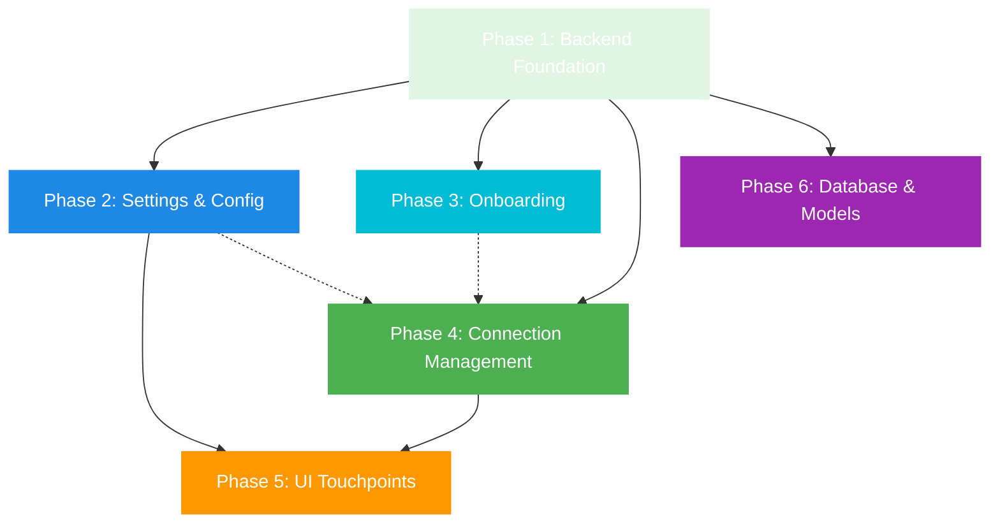

# Hermes Backend Integration Implementation Plan

**Status:** Planning Phase
**Author:** AI Planning Assistant
**Date:** 2026-04-09
**Version:** 1.0

---

## Executive Summary

This plan documents the integration of **hermes-agent** as a SECOND backend option alongside OpenClaw (NOT replacing it). The integration will allow users to choose between OpenClaw Gateway and Hermes Agent as their AI backend, with full support for both in settings, onboarding, and runtime connection management.

### Current State

**What Already Exists:**

- ✅ `lib/services/hermes/hermes_streaming_service.dart` — Full Hermes streaming service using `/v1/runs` + `/v1/runs/{run_id}/events` (agent runs mode) and `/v1/chat/completions` (fallback)
- ✅ `lib/services/providers/hermes_adapter.dart` — LLM provider adapter for the embedded router
- ✅ `ConnectionType.hermes` enum value in `connection_manager_service.dart`
- ✅ `AppConfig.defaultHermesUrl` = `http://127.0.0.1:8642`
- ✅ OpenClaw integration via WebSocket on port 18789 with challenge/handshake auth
- ✅ Hermes settings keys in `settings_preference_service.dart` (hermes_enabled, hermes_url, hermes_api_key)
- ✅ HermesStreamingService registered in DI (line 239-241 in locator.dart)

**What's Missing:**

- ❌ Hermes Gateway Control Service (equivalent to `GatewayControlService`)
- ❌ Settings UI for backend picker (OpenClaw vs Hermes)
- ❌ Hermes-specific settings category (URL, port, model, API key)
- ❌ Hermes option in onboarding flow
- ❌ `UnifiedConnectionService` updates to reflect active backend
- ❌ ProviderType.hermes in provider_configuration.dart
- ❌ Hermes option in Config screen provider dropdown
- ❌ Navigation/settings category updates

---

## Phased Implementation Plan

### Phase 1: Backend Foundation (Independently Shippable)

**Goal:** Establish core backend infrastructure without UI changes

#### 1.1 Create Hermes Gateway Control Service

**File:** `lib/services/hermes_manager/hermes_gateway_control_service.dart` (new)

HTTP-only gateway status service. No CLI shelling out — the app runs locally and
within a tunnel, so all communication is via HTTP. Mirrors `GatewayControlService`
structure but uses HTTP health checks instead of CLI commands.

- Status detection via HTTP GET `/health` endpoint
- No start/stop/restart (user manages the gateway process themselves)
- State management (connected, disconnected, error, unknown)
- Configurable URL/port (default: `http://127.0.0.1:8642`)

**Key methods:**

```dart
Future<void> checkStatus()  // HTTP GET /health
Stream<GatewayState> watchStatus() // Periodic health polling
Future<bool> testConnection() // One-shot connectivity test
```

**Important:** This is NOT a process manager. It is a health monitor. The user is
responsible for starting/stopping their gateway (OpenClaw or Hermes). The app
only detects and connects to running gateways.

**Dependencies:** None (standalone service)

#### 1.2 Register Hermes Gateway Control Service in DI

**File:** `lib/di/locator.dart`

Add Hermes gateway control service registration in `setupCoreServices()`:

```dart
// After line 372 (GatewayControlService registration)
final hermesGatewayControlService = HermesGatewayControlService(_settingsPreferenceService);
serviceLocator.registerSingleton<HermesGatewayControlService>(hermesGatewayControlService);
```

**Dependencies:** Phase 1.1

#### 1.3 Add ProviderType.hermes to Provider Configuration

**File:** `lib/models/provider_configuration.dart`

Add to enum (after line 13):

```dart
enum ProviderType {
  openclaw,
  hermes,  // NEW
  ollama,
  lmStudio,
  openAICompatible,
  custom,
}
```

**Dependencies:** None

#### 1.4 Update ProviderConfigurationFactory for Hermes

**File:** `lib/models/provider_configuration.dart`

Add Hermes provider configuration class and update factory:

- Create `HermesProviderConfiguration` class (similar to Ollama/LMStudio)
- Add case in `ProviderConfigurationFactory.fromJson()` (line 577)
- Add case in `ProviderConfigurationFactory.createDefault()` (line 589)

**Dependencies:** Phase 1.3

---

### Phase 2: Settings & Configuration (Independently Shippable)

**Goal:** Enable backend selection and Hermes-specific settings

#### 2.1 Backend Selection in Settings Preference Service

**File:** `lib/services/settings_preference_service.dart`

Add backend selection preference:

```dart
// Keys (after line 30)
static const String _activeBackendKey = 'settings_active_backend';  // NEW

// Methods
Future<BackendType?> getActiveBackend() async {
  final prefs = await SharedPreferences.getInstance();
  final value = prefs.getString(_activeBackendKey);
  return value != null ? BackendType.values.firstWhere((e) => e.name == value) : null;
}

Future<void> setActiveBackend(BackendType type) async {
  final prefs = await SharedPreferences.getInstance();
  await prefs.setString(_activeBackendKey, type.name);
}
```

Also add backend enum:

```dart
enum BackendType {
  openclaw,
  hermes,
}
```

**Dependencies:** None

#### 2.2 Create Hermes Settings Category Widget

**File:** `lib/widgets/settings/hermes_gateway_category.dart` (new)

Create settings UI for Hermes configuration, mirroring `OpenClawGatewayCategory`:

- Hermes URL (default: http://127.0.0.1:8642)
- Hermes API key (optional, stored in secure storage)
- Connection test button
- Model selection (from Hermes /v1/models endpoint)
- Backend status indicator
- Auto-start Hermes on app launch toggle

**Key widgets:**

- URL text field with validation
- API key field (masked)
- Connection test button with loading state
- Model dropdown (populated from Hermes API)
- Status indicator (connected/disconnected/error)

**Dependencies:** Phase 2.1

#### 2.3 Add Hermes to Settings Categories List

**File:** `lib/widgets/settings/settings_categories.dart` (or equivalent)

Add Hermes category to settings navigation:

- Add entry in settings categories list
- Route to `HermesGatewayCategory`

**Dependencies:** Phase 2.2

#### 2.4 Update Config Screen for Backend Selection

**File:** `lib/screens/config/config_screen.dart`

Add backend selector to Gateway tab (line 210-247):

```dart
// Add to _buildGatewayTab() after LLM Provider section
CardSection(
  title: 'Active Backend',
  children: [
    _dropdown(
      'Backend',
      ['OpenClaw Gateway', 'Hermes Agent'],
      _selectedBackend,
      (v) => setState(() => _selectedBackend = v),
      subtitle: 'Choose which AI backend to use',
    ),
  ],
),
```

**Dependencies:** Phase 2.1

---

### Phase 3: Onboarding Integration (Independently Shippable)

**Goal:** Add Hermes as an option in the setup wizard

#### 3.1 Update Connection Method Selection Step

**File:** `lib/screens/onboarding/steps/connection_method_step.dart`

Add Hermes option to connection method cards:

```dart
// Add after custom connection card (line 73)
ConnectionMethodCard(
  icon: Icons.smart_toy,  // Use appropriate icon
  title: 'Hermes Agent',
  description: 'Hermes Agent server running on this computer',
  selected: wizard.state.selectedMethod == ConnectionMethod.hermes,
  onTap: () => wizard.selectConnectionMethod(ConnectionMethod.hermes),
),
```

**Dependencies:** Phase 1.3

#### 3.2 Update ConnectionMethod Enum

**File:** `lib/services/onboarding/setup_wizard_service.dart`

Add Hermes to enum (after line 17):

```dart
enum ConnectionMethod {
  local,      // OpenClaw local
  hermes,     // NEW
  tailscale,  // OpenClaw remote via Tailscale
  custom,     // OpenClaw custom remote
}
```

**Dependencies:** None

#### 3.3 Update Setup Wizard State

**File:** `lib/services/onboarding/setup_wizard_service.dart`

Add Hermes-specific state tracking (line 34):

```dart
class WizardState {
  // ... existing fields
  final String? hermesUrl;      // NEW
  final String? hermesApiKey;    // NEW
  final bool useHermes;          // NEW
}
```

Update copyWith method to include new fields.

**Dependencies:** Phase 3.2

#### 3.4 Update Wizard Step Logic

**File:** `lib/screens/onboarding/setup_wizard_screen.dart`

Update `_buildSteps()` to handle Hermes method:

```dart
List<Widget> _buildSteps(ConnectionMethod? method) {
  final steps = <Widget>[
    const WelcomeStep(),
    const ConnectionMethodStep(),
    const LocalDetectionStep(),
  ];

  // Conditional steps based on method
  if (method == ConnectionMethod.hermes) {
    steps.add(const HermesUrlStep());  // NEW
    steps.add(const HermesTestStep()); // NEW
  } else if (method == ConnectionMethod.local) {
    steps.add(const GatewayPasswordStep());
  } else if (method == ConnectionMethod.tailscale) {
    steps.add(const TailscaleDiscoveryStep());
  } else if (method == ConnectionMethod.custom) {
    steps.add(const RemoteConnectionStep());
  }

  steps.addAll([
    const ConnectionTestStep(),
    const CompletionStep(),
  ]);

  return steps;
}
```

**Dependencies:** Phase 3.1, Phase 3.3

---

### Phase 4: Connection Management Updates (Independently Shippable)

**Goal:** Update connection services to handle backend switching

#### 4.1 Update Connection Manager for Backend Selection

**File:** `lib/services/connection_manager_service.dart`

Add backend-aware connection routing:

```dart
// Add to class (after line 103)
BackendType? _activeBackend;

BackendType? get activeBackend => _activeBackend;

void setActiveBackend(BackendType? type) {
  _activeBackend = type;
  notifyListeners();
}
```

Update `getBestConnectionType()` (line 244) to respect backend setting:

```dart
ConnectionType getBestConnectionType() {
  // No default — backend must be explicitly chosen
  if (_activeBackend == null) {
    return ConnectionType.none;
  }

  if (_activeBackend == BackendType.hermes) {
    return ConnectionType.hermes;
  }

  if (_activeBackend == BackendType.openclaw) {
    return _preferredConnectionType ?? ConnectionType.local;
  }

  return ConnectionType.none;
}
```

**Dependencies:** Phase 2.1

#### 4.2 Update Unified Connection Service

**File:** `lib/services/unified_connection_service.dart`

Update to reflect active backend:

```dart
void _updateStatus() {
  if (_connectionManager == null) return;

  final isConnected = _connectionManager!.isConnected;
  _isConnected = isConnected;

  // Update connection type based on active backend
  final backend = _connectionManager!.activeBackend;
  if (backend == BackendType.hermes) {
    _connectionType = 'hermes';
    _version = isConnected ? 'Hermes Agent' : null;
  } else {
    _connectionType = isConnected ? 'openclaw' : 'none';
    _version = isConnected ? 'OpenClaw Gateway' : null;
  }

  _models = _connectionManager!.availableModels;

  if (!isConnected) {
    _error = '${backend?.name ?? 'Backend'} disconnected';
  } else {
    _error = null;
  }

  notifyListeners();
}
```

**Dependencies:** Phase 4.1

#### 4.3 Load Backend Preference on Initialization

**File:** `lib/services/connection_manager_service.dart`

Add backend loading in `initialize()` method (line 726):

```dart
Future<void> initialize() async {
  // Load backend preference
  final settings = SettingsPreferenceService();
  final backend = await settings.getActiveBackend();
  setActiveBackend(backend);

  await loadGatewayToken();
  await testConnection();
  // ... rest of initialization
}
```

**Dependencies:** Phase 4.1, Phase 2.1

---

### Phase 5: UI Touchpoints & Polish (Independently Shippable)

**Goal:** Update all UI references to support dual backend

#### 5.1 Update Connection Status Screen

**File:** `lib/screens/settings/connection_status_screen.dart`

Add backend indicator to status display:

- Show active backend (OpenClaw vs Hermes)
- Display backend-specific metrics
- Update status text based on backend

**Dependencies:** Phase 4.1

#### 5.2 Update Home Layout Backend References

**File:** `lib/screens/home/home_layout.dart`

Update references from hardcoded "OpenClaw" to backend-agnostic:

- Line 277: "Message OpenClaw..." → "Message AI..."
- Line 491: Backend-aware placeholder
- Line 223-226: Provider selection UI update

**Dependencies:** Phase 4.1

#### 5.3 Update Navigation Shell Branding

**File:** `lib/widgets/navigation/openclaw_navigation_shell.dart`

Consider renaming or making branding dynamic:

- Line 103: "OPENCLAW" → Dynamic based on active backend
- Line 280: Docs link → Backend-specific docs
- Logo: Add Hermes logo asset (optional)

**Note:** May defer to separate branding update to avoid scope creep.

**Dependencies:** Phase 4.1

#### 5.4 Update About Screen

**File:** `lib/screens/settings/about_settings_screen.dart`

Update description to reflect dual backend support:

- Line 34: Update text to mention both OpenClaw and Hermes

**Dependencies:** None

---

### Phase 6: Database & Models (Independently Shippable)

**Goal:** Ensure data model supports backend selection

#### 6.1 Review Drift Schema for Backend Tracking

**File:** `lib/database/drift_local_brain.dart`

Audit if backend preference needs persistence:

- Check if current schema stores connection/backend info
- Add backend tracking column if needed for analytics/history

**Likely outcome:** No schema changes needed (SharedPreferences handles backend selection)

**Dependencies:** None

#### 6.2 Update Provider Discovery for Hermes

**File:** `lib/services/provider_discovery_service.dart`

Add Hermes detection logic:

- Check `http://127.0.0.1:8642/health` for Hermes
- Return `ProviderInfo` with `ProviderType.hermes`

**Dependencies:** Phase 1.3

---

## Per-File Change List

### New Files (Create from scratch)

1. **`lib/services/hermes_manager/hermes_gateway_control_service.dart`**
   - Purpose: Manage Hermes agent lifecycle (start/stop/status)
   - Pattern: Mirrors `GatewayControlService` structure
   - Dependencies: `SettingsPreferenceService`, `dart:io`

2. **`lib/widgets/settings/hermes_gateway_category.dart`**
   - Purpose: Settings UI for Hermes configuration
   - Pattern: Mirrors `OpenClawGatewayCategory` structure
   - Dependencies: `ConnectionManagerService`, `SettingsPreferenceService`

3. **`lib/screens/onboarding/steps/hermes_url_step.dart`** (optional)
   - Purpose: Onboarding step for Hermes URL configuration
   - Pattern: Similar to `GatewayPasswordStep`
   - Dependencies: `SetupWizardService`

4. **`lib/screens/onboarding/steps/hermes_test_step.dart`** (optional)
   - Purpose: Connection test step for Hermes
   - Pattern: Similar to `ConnectionTestStep`
   - Dependencies: `SetupWizardService`, `HermesStreamingService`

### Modified Files (Changes to existing files)

1. **`lib/di/locator.dart`**
   - Change: Add Hermes gateway control service registration
   - Location: Line ~372 (after GatewayControlService)
   - Risk: Low (service registration only)

2. **`lib/models/provider_configuration.dart`**
   - Change 1: Add `ProviderType.hermes` to enum
   - Change 2: Create `HermesProviderConfiguration` class
   - Change 3: Update `ProviderConfigurationFactory.fromJson()` switch
   - Change 4: Update `ProviderConfigurationFactory.createDefault()` switch
   - Location: Lines 9-13, ~573-613
   - Risk: Low (model extensions)

3. **`lib/services/settings_preference_service.dart`**
   - Change 1: Add backend preference keys and methods
   - Change 2: Add `BackendType` enum (can be separate file)
   - Location: Lines ~27-30, end of file
   - Risk: Low (preference storage only)

4. **`lib/screens/config/config_screen.dart`**
   - Change: Add backend selector dropdown to Gateway tab
   - Location: Line ~210-247 in `_buildGatewayTab()`
   - Risk: Low (UI addition only)

5. **`lib/screens/onboarding/steps/connection_method_step.dart`**
   - Change: Add Hermes connection method card
   - Location: Line ~74 (after custom connection card)
   - Risk: Low (UI addition only)

6. **`lib/services/onboarding/setup_wizard_service.dart`**
   - Change 1: Add `ConnectionMethod.hermes` to enum
   - Change 2: Add Hermes-specific fields to `WizardState`
   - Change 3: Update `copyWith()` method
   - Change 4: Update step counting logic
   - Location: Lines ~14-18, 21-44, ~46-73, ~409-420
   - Risk: Medium (state management changes)

7. **`lib/screens/onboarding/setup_wizard_screen.dart`**
   - Change: Update `_buildSteps()` to handle Hermes method
   - Location: Lines ~139-165
   - Risk: Medium (wizard flow changes)

8. **`lib/services/connection_manager_service.dart`**
   - Change 1: Add `BackendType? _activeBackend` field and getters
   - Change 2: Add `setActiveBackend()` method
   - Change 3: Update `getBestConnectionType()` to respect backend
   - Change 4: Update `initialize()` to load backend preference
   - Location: Lines ~103, 244-263, 726-738
   - Risk: Medium (connection routing logic)

9. **`lib/services/unified_connection_service.dart`**
   - Change: Update `_updateStatus()` to reflect active backend
   - Location: Lines ~28-44
   - Risk: Low (status display only)

10. **`lib/screens/settings/connection_status_screen.dart`**
    - Change: Add backend indicator to status display
    - Location: Line ~140-220 in `_buildOpenClawStatus()` area
    - Risk: Low (UI update only)

11. **`lib/screens/home/home_layout.dart`**
    - Change 1: Update hardcoded "OpenClaw" references to backend-agnostic
    - Change 2: Update chat placeholder text
    - Location: Lines ~90, 223-226, 277, 491
    - Risk: Low (text updates only)

12. **`lib/screens/settings/about_settings_screen.dart`**
    - Change: Update description to mention both backends
    - Location: Line ~34
    - Risk: Low (text update only)

13. **`lib/widgets/navigation/openclaw_navigation_shell.dart`** (optional)
    - Change: Make branding dynamic based on active backend
    - Location: Lines ~91, 103, 280
    - Risk: Medium (navigation changes, may defer)

14. **`lib/services/provider_discovery_service.dart`**
    - Change: Add Hermes detection logic
    - Location: End of file, new method `discoverHermes()`
    - Risk: Low (discovery extension only)

### Files Requiring No Changes (Audit Results)

Based on grep analysis, these files reference OpenClaw but **DO NOT need changes**:

1. **`lib/config/app_config.dart`**
   - Reason: Already has `defaultHermesUrl` constant
   - References are descriptive only

2. **`lib/services/hermes/hermes_streaming_service.dart`**
   - Reason: Already implemented, no changes needed

3. **`lib/services/providers/hermes_adapter.dart`**
   - Reason: Already implemented, no changes needed

4. **`lib/widgets/settings/openclaw_gateway_category.dart`**
   - Reason: OpenClaw-specific settings, Hermes will have parallel category

5. **`lib/screens/instances/instances_screen.dart`**
   - Reason: Gateway control UI is backend-specific, no changes needed

6. **`lib/screens/nodes/nodes_screen.dart`**
   - Reason: Nodes display is backend-agnostic

7. **`lib/database/drift_local_brain.dart`**
   - Reason: Schema doesn't need backend tracking (SharedPreferences handles it)

8. **`lib/config/router.dart`**
   - Reason: Navigation is backend-agnostic

---

## Dependencies Between Phases



**Critical Path:**

- Phase 1 must complete before Phases 2-4 (dependency chain)
- Phases 2-4 can proceed in parallel after Phase 1
- Phase 5 depends on Phases 2-4
- Phase 6 is independent (can run anytime)

**Recommended Implementation Order:**

1. Phase 1 (all tasks)
2. Phase 2 (all tasks)
3. Phase 4 (all tasks)
4. Phase 3 (all tasks)
5. Phase 5 (all tasks)
6. Phase 6 (all tasks)

---

## Risk Areas & Mitigation Strategies

### High Risk Areas

#### 1. Connection Manager Routing Logic

**File:** `lib/services/connection_manager_service.dart`
**Risk:** Breaking existing OpenClaw connection behavior when adding backend selection
**Mitigation:**

- No backend pre-selected — user must explicitly choose (provider-agnostic design)
- Add comprehensive unit tests for connection type selection
- Test behavior when selected backend is unreachable (show error, prompt to switch)

**Testing Strategy:**

- Unit tests for `getBestConnectionType()` with all backend states
- Integration tests with actual OpenClaw and Hermes instances
- Regression tests for existing OpenClaw-only workflows

#### 2. Onboarding State Management

**File:** `lib/services/onboarding/setup_wizard_service.dart`
**Risk:** Complex state machine with new Hermes path may introduce bugs
**Mitigation:**

- Keep OpenClaw path unchanged as much as possible
- Add validation for Hermes URL format
- Test wizard flow end-to-end for all connection methods

**Testing Strategy:**

- Manual wizard walkthrough for each connection method
- State transition testing with rapid method switching
- Error handling tests for invalid Hermes configurations

### Medium Risk Areas

#### 3. Settings Persistence Race Conditions

**File:** `lib/services/settings_preference_service.dart`
**Risk:** Backend preference changes may not propagate to running services
**Mitigation:**

- Use `notifyListeners()` consistently when backend changes
- ConnectionManager should listen to SettingsPreferenceService changes
- Add debounce for rapid backend switching attempts

**Testing Strategy:**

- Rapid backend switching tests
- Service lifecycle tests during backend changes
- SharedPreferences stress tests

#### 4. DI Service Registration Order

**File:** `lib/di/locator.dart`
**Risk:** HermesGatewayControlService registration may conflict with existing services
**Mitigation:**

- Register in appropriate phase (core vs authenticated)
- Ensure no circular dependencies
- Test service locator initialization after registration

**Testing Strategy:**

- Service locator unit tests
- Integration tests for all services
- Service availability checks at startup

### Low Risk Areas

#### 5. UI Text Updates

**Files:** `home_layout.dart`, `about_settings_screen.dart`
**Risk:** Inconsistent terminology across the app
**Mitigation:**

- Use backend-agnostic terms ("AI backend", "gateway", "agent")
- Keep OpenClaw and Hermes names in settings/backend selection only
- Create terminology guide for UI text

#### 6. Navigation Shell Branding

**File:** `lib/widgets/navigation/openclaw_navigation_shell.dart`
**Risk:** Dynamic branding may confuse users
**Mitigation:**

- Keep OpenClaw branding prominent (primary backend)
- Add subtle Hermes indicator when active
- Consider keeping branding static for this phase

---

## Testing Strategy

### Unit Tests

1. **HermesGatewayControlService Tests**
   - Test start/stop/status commands
   - Test health check parsing
   - Test auto-restart behavior
   - Mock Process.run for CLI commands

2. **ConnectionManager Backend Selection Tests**
   - Test `getBestConnectionType()` with all backend states
   - Test `setActiveBackend()` behavior
   - Test fallback to OpenClaw when Hermes unavailable

3. **SetupWizardService Tests**
   - Test state transitions with Hermes method
   - Test Hermes URL validation
   - Test Hermes vs OpenClaw path separation

### Integration Tests

1. **Backend Switching Tests**
   - Start with OpenClaw, switch to Hermes
   - Start with Hermes, switch to OpenClaw
   - Test connection state propagation

2. **Settings Persistence Tests**
   - Set backend to Hermes, restart app, verify persistence
   - Set backend to OpenClaw, restart app, verify persistence
   - Test backend unset (null) behavior

3. **Onboarding Flow Tests**
   - Complete wizard with Hermes backend
   - Complete wizard with OpenClaw backend
   - Test wizard cancellation and restart

### Manual Testing Checklist

- [ ] Can select Hermes backend in settings
- [ ] Can select OpenClaw backend in settings
- [ ] Settings persist across app restart
- [ ] Hermes connection test succeeds when Hermes running
- [ ] Hermes connection test fails when Hermes not running
- [ ] OpenClaw connection test succeeds when OpenClaw running
- [ ] OpenClaw connection test fails when OpenClaw not running
- [ ] Can start/stop Hermes from settings (if implemented)
- [ ] Can start/stop OpenClaw from settings
- [ ] Onboarding wizard shows Hermes option
- [ ] Can complete setup wizard with Hermes
- [ ] Can complete setup wizard with OpenClaw
- [ ] Chat works with Hermes backend selected
- [ ] Chat works with OpenClaw backend selected
- [ ] Connection status screen shows correct backend
- [ ] Model selection shows correct models for active backend

---

## Rollback Strategy

If critical issues arise during integration:

1. **Feature Flags**
   - Add `AppConfig.enableHermesBackend = false` to disable Hermes entirely
   - Gate all Hermes-related code behind this flag
   - Safe rollback without code removal

2. **Branch Isolation**
   - Develop on feature branch: `feature/hermes-backend-integration`
   - Keep main branch stable with OpenClaw-only
   - Merge only after comprehensive testing

3. **Gradual Rollout**
   - Initially hide Hermes option behind debug mode only
   - Enable for subset of users (beta testing)
   - Full rollout after validation

---

## Success Criteria

A phase is considered complete when:

- [ ] All files in the phase are modified/created as specified
- [ ] Code passes `flutter analyze` (no new warnings)
- [ ] Code passes `flutter test` (all tests green)
- [ ] Manual testing checklist for that phase is complete
- [ ] No regression in existing OpenClaw functionality

**Overall Integration Complete When:**

- [ ] All 6 phases completed
- [ ] Full manual testing checklist passed
- [ ] Documentation updated (if applicable)
- [ ] Code reviewed and approved
- [ ] Feature branch ready for merge to main

---

## Design Decisions

1. **No Default Backend** — The app is provider-agnostic. No backend is pre-selected.
   The user must explicitly choose a backend during onboarding or in settings.
   There is no "default to OpenClaw" fallback.

2. **HTTP-Only Communication** — Both OpenClaw and Hermes gateways communicate
   via HTTP. No CLI shelling out for gateway control. The app runs locally and
   within a tunnel, so HTTP is the correct abstraction.

3. **No Process Management** — The app does NOT start/stop gateway processes.
   It detects and connects to running gateways via HTTP health checks. The user
   manages their own gateway processes.

4. **Authentication Strategy**
   - OpenClaw: Uses challenge/handshake auth (existing behavior)
   - Hermes: No auth required by default (local-only)
   - API keys stored per-backend in secure storage if needed

## Remaining Open Questions

1. **Model Configuration**
   - Should model selection be stored per-backend or globally?
   - Do Hermes and OpenClaw support different model formats?

2. **UI Asset Requirements**
   - Is a Hermes logo needed?
   - What icon should represent Hermes in UI?
   - Color scheme for Hermes-specific UI elements?

3. **Migration Strategy**
   - Show setup wizard for existing users who haven't chosen a backend?
   - How to handle existing OpenClaw-only users?

---

## Appendix: File References

### Key Files Read During Planning

1. `AGENTS.md` - Project overview and agent context
2. `lib/di/locator.dart` - Service registration and DI
3. `lib/config/router.dart` - Navigation structure
4. `lib/services/connection_manager_service.dart` - Connection management
5. `lib/services/unified_connection_service.dart` - Unified connection view
6. `lib/services/openclaw_manager/gateway_control_service.dart` - OpenClaw control reference
7. `lib/config/app_config.dart` - App configuration constants
8. `lib/screens/onboarding/setup_wizard_screen.dart` - Onboarding flow
9. `lib/widgets/settings/openclaw_gateway_category.dart` - Settings UI reference
10. `lib/services/hermes/hermes_streaming_service.dart` - Existing Hermes service
11. `lib/services/providers/hermes_adapter.dart` - Existing Hermes provider
12. `lib/services/settings_preference_service.dart` - Settings persistence
13. `lib/screens/onboarding/steps/connection_method_step.dart` - Connection selection UI
14. `lib/screens/config/config_screen.dart` - Config screen structure
15. `lib/models/provider_configuration.dart` - Provider models

### Grep Analysis Summary

- **Total files referencing OpenClaw/openclaw:** 286 matches across ~53 files
- **Files requiring changes:** 14 files (modified)
- **Files requiring no changes:** ~39 files (audit complete)
- **New files to create:** 4 files

---

**Document Version:** 1.0
**Last Updated:** 2026-04-09
**Status:** Ready for Review
