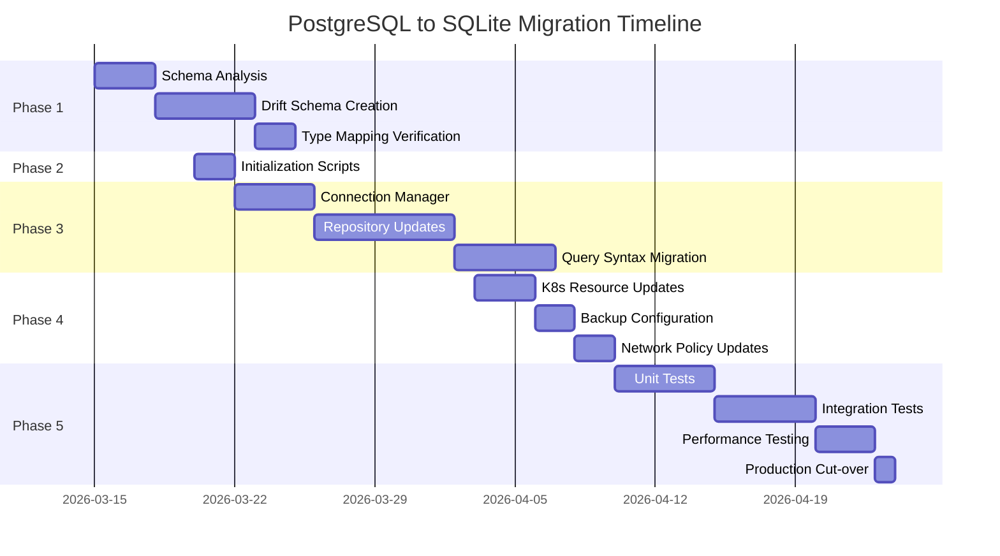

# Codebase Stabilization and Infrastructure Migration Plan
## PostgreSQL to Drift/SQLite Migration

**Document Version:** 1.0  
**Date:** 2026-03-11  
**Author:** Senior Backend Architect & SRE Team  
**Status:** Draft - Pending Approval

---

## Executive Summary

This document outlines a comprehensive plan to deprecate the existing PostgreSQL dependency in the CloudToLocalLLM API backend and refactor to utilize Drift library for SQLite. The migration will simplify infrastructure, reduce operational costs, and align the backend storage with the existing Flutter desktop client architecture.

### Current State Analysis

| Component | Technology | Location |
|-----------|------------|----------|
| API Backend Database | PostgreSQL 16 | `services/api-backend/database/` |
| Flutter Desktop Database | Drift/SQLite | `lib/database/drift_local_brain.dart` |
| Kubernetes Database | PostgreSQL StatefulSet | `k8s/deployments/base/deployments/postgres.yaml` |
| Node.js Driver | `pg` (v8.16.3) | `services/api-backend/package.json` |

### Key Findings

1. **Existing SQLite Foundation**: The Flutter app already has a comprehensive Drift schema in [`lib/database/drift_local_brain.dart`](lib/database/drift_local_brain.dart:1) with 25+ tables covering users, conversations, agents, rate limiting, and avatar systems.

2. **PostgreSQL Schema Scope**: The backend PostgreSQL schema contains 8 core tables:
   - `users` - User identities
   - `user_sessions` - Authentication sessions
   - `tunnel_connections` - Active tunnel management
   - `audit_logs` - Security audit trail
   - `api_usage` - Rate limiting and analytics
   - `user_preferences` - User settings
   - `conversations` - Chat history metadata
   - `messages` - Conversation messages

3. **Infrastructure Complexity**: Current setup requires PostgreSQL StatefulSet with persistent volumes, init scripts, and separate auth database.

---

## Phase 1: Schema & ORM Migration

### 1.1 Type Mapping Analysis

| PostgreSQL Type | SQLite/Drift Equivalent | Notes |
|-----------------|-------------------------|-------|
| `UUID` | `TEXT` | Use UUID strings, Drift has no native UUID |
| `TIMESTAMPTZ` | `DATETIME` | Store as ISO 8601 strings |
| `JSONB` | `TEXT` | Serialize/deserialize JSON |
| `INET` | `TEXT` | Store IP addresses as strings |
| `SERIAL` | `INTEGER AUTOINCREMENT` | Auto-increment integers |
| `BOOLEAN` | `INTEGER` | 0/1 values |
| `TEXT` | `TEXT` | Direct mapping |
| `INTEGER` | `INTEGER` | Direct mapping |

### 1.2 Schema Conversion Tasks

#### 1.2.1 Create Unified Drift Schema for Backend

**File:** `services/api-backend/database/schema.drift.dart`

```dart
// Backend-specific tables that complement existing Flutter schema

/// User sessions table for authentication
class BackendUserSessions extends Table {
  TextColumn get id => text()();
  TextColumn get userId => text()();
  TextColumn get sessionToken => text().unique()();
  TextColumn get jwtTokenHash => text().nullable()();
  TextColumn get jwtAccessToken => text().nullable()();
  TextColumn get jwtIdToken => text().nullable()();
  TextColumn get refreshToken => text().nullable()();
  DateTimeColumn get expiresAt => dateTime()();
  DateTimeColumn get createdAt => dateTime().withDefault(currentDateAndTime)();
  DateTimeColumn get lastActivity => dateTime().withDefault(currentDateAndTime)();
  TextColumn get ipAddress => text().nullable()();
  TextColumn get userAgent => text().nullable()();
  BoolColumn get isActive => boolean().withDefault(const Constant(true))();

  @override
  Set<Column> get primaryKey => {id};
}

/// Tunnel connections table
class BackendTunnelConnections extends Table {
  TextColumn get id => text()();
  TextColumn get userId => text()();
  TextColumn get tunnelId => text().unique()();
  TextColumn get bridgeId => text().nullable()();
  TextColumn get status => text().withDefault(const Constant('pending'))();
  TextColumn get connectionType => text().withDefault(const Constant('http'))();
  TextColumn get targetHost => text().nullable()();
  IntColumn get targetPort => integer().nullable()();
  DateTimeColumn get createdAt => dateTime().withDefault(currentDateAndTime)();
  DateTimeColumn get updatedAt => dateTime().withDefault(currentDateAndTime)();
  DateTimeColumn get lastActivity => dateTime().withDefault(currentDateAndTime)();
  TextColumn get metadata => text().nullable()(); // JSON as text

  @override
  Set<Column> get primaryKey => {id};
}

/// Audit logs table
class BackendAuditLogs extends Table {
  IntColumn get id => integer().autoIncrement()();
  TextColumn get userId => text().nullable()();
  TextColumn get action => text()();
  TextColumn get resourceType => text().nullable()();
  TextColumn get resourceId => text().nullable()();
  TextColumn get details => text().nullable()(); // JSON as text
  TextColumn get ipAddress => text().nullable()();
  TextColumn get userAgent => text().nullable()();
  DateTimeColumn get createdAt => dateTime().withDefault(currentDateAndTime)();
  TextColumn get severity => text().withDefault(const Constant('info'))();
}

/// API usage tracking
class BackendApiUsage extends Table {
  IntColumn get id => integer().autoIncrement()();
  TextColumn get userId => text()();
  TextColumn get endpoint => text()();
  TextColumn get method => text()();
  IntColumn get statusCode => integer().nullable()();
  IntColumn get responseTimeMs => integer().nullable()();
  IntColumn get requestSizeBytes => integer().nullable()();
  IntColumn get responseSizeBytes => integer().nullable()();
  DateTimeColumn get createdAt => dateTime().withDefault(currentDateAndTime)();
  TextColumn get metadata => text().nullable()(); // JSON as text
}

/// User preferences
class BackendUserPreferences extends Table {
  TextColumn get userId => text()();
  TextColumn get preferences => text().nullable()(); // JSON as text
  DateTimeColumn get createdAt => dateTime().withDefault(currentDateAndTime)();
  DateTimeColumn get updatedAt => dateTime().withDefault(currentDateAndTime)();

  @override
  Set<Column> get primaryKey => {userId};
}
```

#### 1.2.2 Handle Complex Relationships

**PostgreSQL Foreign Keys → Drift References:**

```dart
// PostgreSQL: FOREIGN KEY (user_id) REFERENCES users(id) ON DELETE CASCADE
// Drift equivalent:
TextColumn get userId => text().references(Users, #id)();
```

**PostgreSQL CHECK Constraints → Drift Validations:**

```dart
// PostgreSQL: CHECK (status IN ('pending', 'active', 'inactive', 'error'))
// Drift: Handle in business logic layer or use custom constraints
@override
List<String> get customConstraints => [
  "CHECK (status IN ('pending', 'active', 'inactive', 'error'))"
];
```

#### 1.2.3 Trigger Migration

PostgreSQL triggers for `updated_at` columns must be migrated to application-level logic:

```dart
// In repository/service layer:
Future<void> updateTunnelConnection(TunnelConnection connection) async {
  connection.updatedAt = DateTime.now();
  await (update(backendTunnelConnections)
    ..where((t) => t.id.equals(connection.id)))
    .write(connection);
}
```

### 1.3 Migration Files to Create

| Source File | Target File | Action |
|-------------|-------------|--------|
| `schema.pg.sql` | `schema.drift.dart` | Convert to Drift DSL |
| `schema-auth.pg.sql` | `schema-auth.drift.dart` | Convert auth tables |
| `migrations/*.sql` | `migrations/*.drift.dart` | Convert each migration |

---

## Phase 2: Schema Initialization

### 2.1 Initial SQLite Database Creation

```javascript
// scripts/init-sqlite-schema.js

import Database from 'better-sqlite3';

function initializeSqliteSchema(db) {
  // Enable foreign keys
  db.pragma('foreign_keys = ON');
  
  // Create tables
  db.exec(`
    -- Users table
    CREATE TABLE IF NOT EXISTS users (
      id TEXT PRIMARY KEY,
      email TEXT UNIQUE NOT NULL,
      jwt_id TEXT UNIQUE,
      name TEXT,
      nickname TEXT,
      picture TEXT,
      email_verified INTEGER DEFAULT 0,
      locale TEXT,
      created_at TEXT DEFAULT (datetime('now')),
      updated_at TEXT DEFAULT (datetime('now')),
      deleted_at TEXT,
      last_login TEXT,
      login_count INTEGER DEFAULT 0,
      metadata TEXT
    );
    
    -- User sessions table
    CREATE TABLE IF NOT EXISTS backend_user_sessions (
      id TEXT PRIMARY KEY,
      user_id TEXT NOT NULL,
      session_token TEXT UNIQUE NOT NULL,
      jwt_token_hash TEXT,
      jwt_access_token TEXT,
      jwt_id_token TEXT,
      refresh_token TEXT,
      expires_at TEXT NOT NULL,
      created_at TEXT DEFAULT (datetime('now')),
      last_activity TEXT DEFAULT (datetime('now')),
      ip_address TEXT,
      user_agent TEXT,
      is_active INTEGER DEFAULT 1,
      FOREIGN KEY (user_id) REFERENCES users(id) ON DELETE CASCADE
    );
    
    -- Create indexes
    CREATE INDEX IF NOT EXISTS idx_users_email ON users(email);
    CREATE INDEX IF NOT EXISTS idx_sessions_user_id ON backend_user_sessions(user_id);
    CREATE INDEX IF NOT EXISTS idx_sessions_token ON backend_user_sessions(session_token);
  `);
  
  console.log('SQLite schema initialized');
}
```

### 2.2 Environment Cut-over

1. Scale down application instances to 0.
2. Update deployment environment variables to use `DB_TYPE=sqlite` and mount the persistent volume.
3. Run the initialization script `scripts/init-sqlite-schema.js` on the mounted volume.
4. Scale application instances back up to handle new requests using the new SQLite schema.

---

## Phase 3: Backend Refactoring

### 3.1 Dependency Changes

#### 3.1.1 Remove PostgreSQL Dependencies

**File:** `services/api-backend/package.json`

```diff
{
  "dependencies": {
-   "pg": "^8.16.3",
-   "postgres-array": "~2.0.0",
-   "postgres-bytea": "~1.0.0",
-   "postgres-date": "~1.0.4",
-   "postgres-interval": "^1.1.0",
+   "better-sqlite3": "^11.0.0",
+   "drift-orm": "^1.0.0"
  }
}
```

#### 3.1.2 Add SQLite Dependencies

```json
{
  "dependencies": {
    "better-sqlite3": "^11.0.0",
    "drift-orm": "^1.0.0"
  },
  "optionalDependencies": {
    "better-sqlite3-multiple-ciphers": "^11.0.0"
  }
}
```

### 3.2 Connection Logic Refactoring

#### 3.2.1 Create SQLite Connection Manager

**File:** `services/api-backend/database/sqlite-pool.js`

```javascript
/**
 * SQLite Connection Manager
 * Replaces PostgreSQL pool with SQLite database connection
 */

import Database from 'better-sqlite3';
import path from 'path';
import logger from '../logger.js';

let db = null;
let dbMetrics = {
  totalQueries: 0,
  totalTransactions: 0,
  errors: 0,
  lastHealthCheck: null,
  healthCheckStatus: 'unknown',
};

/**
 * Get database path from environment or use default
 */
function getDatabasePath() {
  const dbPath = process.env.SQLITE_DB_PATH || 
    process.env.DB_PATH || 
    path.join(process.env.DATA_DIR || '/data', 'cloudtolocalllm.db');
  
  return dbPath;
}

/**
 * Initialize SQLite database connection
 */
export function initializeDatabase() {
  if (db) {
    return db;
  }

  const dbPath = getDatabasePath();
  
  logger.info('Initializing SQLite database', { path: dbPath });

  // Test environment mock
  if (process.env.NODE_ENV === 'test' && !process.env.SQLITE_DB_PATH) {
    logger.info('Using in-memory SQLite for test environment');
    db = new Database(':memory:');
  } else {
    db = new Database(dbPath, {
      verbose: process.env.SQLITE_DEBUG === 'true' ? console.log : null,
      fileMustExist: false,
    });
  }

  // Enable optimizations
  db.pragma('journal_mode = WAL');
  db.pragma('foreign_keys = ON');
  db.pragma('synchronous = NORMAL');
  db.pragma('cache_size = -64000'); // 64MB cache
  db.pragma('temp_store = MEMORY');
  db.pragma('mmap_size = 268435456'); // 256MB mmap

  // Handle errors
  db.on('error', (err) => {
    dbMetrics.errors++;
    logger.error('SQLite database error', { error: err.message });
  });

  logger.info('SQLite database initialized successfully');
  return db;
}

/**
 * Get database instance
 */
export function getDatabase() {
  if (!db) {
    return initializeDatabase();
  }
  return db;
}

/**
 * Execute a query with parameters
 */
export function query(sql, params = []) {
  const database = getDatabase();
  
  try {
    dbMetrics.totalQueries++;
    
    // Determine if this is a SELECT or write operation
    const operation = sql.trim().toUpperCase().split(' ')[0];
    
    if (operation === 'SELECT' || operation === 'WITH') {
      const stmt = database.prepare(sql);
      return { rows: stmt.all(...params), changes: 0 };
    } else {
      const stmt = database.prepare(sql);
      const result = stmt.run(...params);
      return { 
        rows: [{ id: result.lastInsertRowid }], 
        changes: result.changes 
      };
    }
  } catch (error) {
    dbMetrics.errors++;
    logger.error('SQLite query error', { 
      sql: sql.substring(0, 100), 
      error: error.message 
    });
    throw error;
  }
}

/**
 * Execute a transaction
 */
export function transaction(callback) {
  const database = getDatabase();
  dbMetrics.totalTransactions++;
  
  return database.transaction(callback)();
}

/**
 * Health check
 */
export async function healthCheck() {
  const startTime = Date.now();
  
  try {
    if (!db) {
      return {
        healthy: false,
        error: 'Database not initialized',
        timestamp: new Date().toISOString(),
      };
    }
    
    const result = db.prepare('SELECT 1 as health_check').get();
    const responseTime = Date.now() - startTime;
    
    dbMetrics.lastHealthCheck = new Date().toISOString();
    dbMetrics.healthCheckStatus = 'healthy';
    
    return {
      healthy: true,
      responseTime,
      metrics: { ...dbMetrics },
      timestamp: dbMetrics.lastHealthCheck,
    };
  } catch (error) {
    dbMetrics.healthCheckStatus = 'unhealthy';
    dbMetrics.errors++;
    
    return {
      healthy: false,
      error: error.message,
      responseTime: Date.now() - startTime,
      timestamp: new Date().toISOString(),
    };
  }
}

/**
 * Close database connection
 */
export function closeDatabase() {
  if (!db) {
    logger.warn('Database already closed or not initialized');
    return;
  }
  
  logger.info('Closing SQLite database');
  db.close();
  db = null;
  logger.info('SQLite database closed');
}

export default {
  initializeDatabase,
  getDatabase,
  query,
  transaction,
  healthCheck,
  closeDatabase,
};
```

### 3.3 Query Syntax Adaptation

#### 3.3.1 Query Translation Guide

| PostgreSQL | SQLite Equivalent |
|------------|-------------------|
| `$1, $2, $3` | `?, ?, ?` |
| `RETURNING *` | Use `lastInsertRowid` + SELECT |
| `NOW()` | `datetime('now')` |
| `gen_random_uuid()` | Use app-level UUID generation |
| `JSONB` operators | Use `json_extract()` |
| `ILIKE` | Use `LIKE` with `COLLATE NOCASE` |
| `LIMIT $1 OFFSET $2` | `LIMIT ? OFFSET ?` |

#### 3.3.2 Repository Pattern Migration

**Before (PostgreSQL):**

```javascript
// services/user-service.js (PostgreSQL version)
async function createUser(userData) {
  const result = await pool.query(
    `INSERT INTO users (id, email, name) 
     VALUES (gen_random_uuid(), $1, $2) 
     RETURNING *`,
    [userData.email, userData.name]
  );
  return result.rows[0];
}
```

**After (SQLite):**

```javascript
// services/user-service.js (SQLite version)
import { v4 as uuidv4 } from 'uuid';
import { getDatabase } from '../database/sqlite-pool.js';

async function createUser(userData) {
  const db = getDatabase();
  const id = uuidv4();
  const now = new Date().toISOString();
  
  const stmt = db.prepare(`
    INSERT INTO users (id, email, name, created_at, updated_at)
    VALUES (?, ?, ?, ?, ?)
  `);
  
  stmt.run(id, userData.email, userData.name, now, now);
  
  // Fetch the created user
  const user = db.prepare('SELECT * FROM users WHERE id = ?').get(id);
  return user;
}
```

### 3.4 Files to Modify

| File | Changes Required |
|------|------------------|
| [`database/db-pool.js`](services/api-backend/database/db-pool.js:1) | Replace with `sqlite-pool.js` |
| [`database/migrate-pg.js`](services/api-backend/database/migrate-pg.js:1) | Create `migrate-sqlite.js` |
| [`database/query-wrapper.js`](services/api-backend/database/query-wrapper.js:1) | Adapt for SQLite |
| [`server.js`](services/api-backend/server.js:1) | Update database imports |
| All route files | Update query syntax from `$1` to `?` |
| All service files | Adapt to SQLite API |

---

## Phase 4: Cloud Infrastructure Optimization

### 4.1 Kubernetes Resource Removal

#### 4.1.1 Remove PostgreSQL StatefulSet

**Files to Delete:**
- `k8s/deployments/base/deployments/postgres.yaml`
- `k8s/deployments/base/services/postgres.yaml`
- `k8s/deployments/base/utilities/backup-cronjob.yaml`
- `k8s/deployments/base/utilities/create-db-users.sql`
- `config/docker/Dockerfile.postgres`
- `config/docker/postgres-entrypoint.sh`
- `config/docker/postgres-init.sh`

#### 4.1.2 Update Kustomization Files

**File:** `k8s/deployments/base/kustomization.yaml`

```diff
resources:
  - namespace.yaml
  - rbac.yaml
  - network-policies.yaml
  - configmap.yaml
  - secrets.yaml
  - deployments/api-backend.yaml
  - deployments/streaming-proxy.yaml
- - deployments/postgres.yaml
- - deployments/redis.yaml
+ - deployments/redis.yaml
  - services/api-backend.yaml
  - services/streaming-proxy.yaml
- - services/postgres.yaml
  - services/redis.yaml
```

### 4.2 Persistent Volume Configuration

#### 4.2.1 Create SQLite Data Volume

**File:** `k8s/deployments/base/pvc-sqlite-data.yaml`

```yaml
apiVersion: v1
kind: PersistentVolumeClaim
metadata:
  name: sqlite-data
  namespace: CloudToLocalLLM
spec:
  accessModes:
    - ReadWriteOnce
  resources:
    requests:
      storage: 10Gi
  storageClassName: standard
```

#### 4.2.2 Update API Backend Deployment

**File:** `k8s/deployments/base/deployments/api-backend.yaml`

```diff
spec:
  template:
    spec:
-     initContainers:
-       - name: wait-for-postgres
-         image: postgres:16-alpine
-         command:
-           - sh
-           - -c
-           - |
-             until pg_isready -h postgres.CloudToLocalLLM.svc.cluster.local -p 5432; do
-               echo "Waiting for postgres..."
-               sleep 2
-             done
      containers:
        - name: api-backend
          env:
-           - name: DB_TYPE
-             value: "postgresql"
-           - name: DB_HOST
-             value: "postgres"
-           - name: DB_PORT
-             value: "5432"
+           - name: DB_TYPE
+             value: "sqlite"
+           - name: SQLITE_DB_PATH
+             value: "/data/cloudtolocalllm.db"
          volumeMounts:
+           - name: sqlite-data
+             mountPath: /data
      volumes:
+       - name: sqlite-data
+         persistentVolumeClaim:
+           claimName: sqlite-data
```

### 4.3 Backup Strategy

#### 4.3.1 SQLite Backup CronJob

**File:** `k8s/deployments/base/utilities/sqlite-backup-cronjob.yaml`

```yaml
apiVersion: batch/v1
kind: CronJob
metadata:
  name: sqlite-backup
  namespace: CloudToLocalLLM
spec:
  schedule: "0 */6 * * *"  # Every 6 hours
  jobTemplate:
    spec:
      template:
        spec:
          containers:
            - name: backup
              image: alpine:3.19
              command:
                - /bin/sh
                - -c
                - |
                  apk add --no-cache sqlite
                  DATE=$(date +%Y%m%d-%H%M%S)
                  sqlite3 /data/cloudtolocalllm.db ".backup /backup/backup-${DATE}.db"
                  # Retain last 7 backups
                  cd /backup && ls -t | tail -n +8 | xargs -r rm
              volumeMounts:
                - name: sqlite-data
                  mountPath: /data
                  readOnly: true
                - name: backup-storage
                  mountPath: /backup
          volumes:
            - name: sqlite-data
              persistentVolumeClaim:
                claimName: sqlite-data
            - name: backup-storage
              persistentVolumeClaim:
                claimName: backup-storage
          restartPolicy: OnFailure
```

### 4.4 Concurrency Handling

#### 4.4.1 Single-Writer Pattern

SQLite supports multiple readers but requires serialized writes. Implement connection pooling:

```javascript
// database/sqlite-pool.js

class SQLiteConnectionPool {
  constructor(dbPath, options = {}) {
    this.writeDb = new Database(dbPath, options);
    this.writeDb.pragma('journal_mode = WAL');
    
    // For read-heavy workloads, create read-only connections
    this.readDbs = [];
    this.maxReaders = options.maxReaders || 4;
    
    for (let i = 0; i < this.maxReaders; i++) {
      const readDb = new Database(dbPath, { readonly: true, ...options });
      this.readDbs.push(readDb);
    }
    
    this.currentReader = 0;
  }
  
  async read(sql, params = []) {
    const db = this.readDbs[this.currentReader];
    this.currentReader = (this.currentReader + 1) % this.maxReaders;
    return db.prepare(sql).all(...params);
  }
  
  async write(sql, params = []) {
    // Serialize writes with mutex
    return this.writeLock.execute(async () => {
      return this.writeDb.prepare(sql).run(...params);
    });
  }
}
```

### 4.5 Network Policy Updates

**File:** `k8s/deployments/base/network-policies.yaml`

```diff
- ---
- # Allow API backend to communicate with PostgreSQL
- apiVersion: networking.k8s.io/v1
- kind: NetworkPolicy
- metadata:
-   name: allow-api-to-postgres
-   namespace: CloudToLocalLLM
- ...
- ---
- # Allow ingress to PostgreSQL from API backend only
- apiVersion: networking.k8s.io/v1
- kind: NetworkPolicy
- metadata:
-   name: allow-postgres-ingress
-   namespace: CloudToLocalLLM
- ...
```

---

## Phase 5: Stabilization & QA

### 5.1 Testing Roadmap

#### 5.1.1 Unit Tests

| Test Suite | Description | Priority |
|------------|-------------|----------|
| `sqlite-pool.test.js` | Connection management, query execution | P0 |
| `user-repository.test.js` | CRUD operations on users table | P0 |
| `session-repository.test.js` | Session management operations | P0 |
| `tunnel-repository.test.js` | Tunnel connection operations | P0 |
| `audit-repository.test.js` | Audit log operations | P1 |
| `migration-verify.test.js` | Data integrity verification | P0 |

#### 5.1.2 Integration Tests

```javascript
// test/api-backend/integration/sqlite-integration.test.js

describe('SQLite Integration Tests', () => {
  let db;
  
  beforeAll(async () => {
    db = initializeDatabase({ path: ':memory:' });
    await runMigrations(db);
  });
  
  afterAll(() => {
    closeDatabase();
  });
  
  describe('User Operations', () => {
    test('should create and retrieve user', async () => {
      const user = await createUser({
        email: 'test@example.com',
        name: 'Test User'
      });
      
      expect(user.id).toBeDefined();
      expect(user.email).toBe('test@example.com');
      
      const retrieved = await getUserById(user.id);
      expect(retrieved).toEqual(user);
    });
    
    test('should enforce unique email constraint', async () => {
      await createUser({ email: 'unique@example.com' });
      
      await expect(
        createUser({ email: 'unique@example.com' })
      ).rejects.toThrow(/UNIQUE constraint failed/);
    });
  });
  
  describe('Transaction Support', () => {
    test('should rollback on error', async () => {
      const initialCount = getUserCount();
      
      expect(async () => {
        await transaction(() => {
          createUser({ email: 'tx1@example.com' });
          throw new Error('Simulated error');
        });
      }).toThrow();
      
      expect(getUserCount()).toBe(initialCount);
    });
  });
});
```

#### 5.1.3 Performance Benchmarks

| Operation | PostgreSQL Baseline | SQLite Target | Acceptable Threshold |
|-----------|---------------------|---------------|---------------------|
| User insert | 5ms | <10ms | <20ms |
| User select by ID | 2ms | <5ms | <10ms |
| Session create | 5ms | <10ms | <20ms |
| Audit log insert | 3ms | <8ms | <15ms |
| Bulk insert (1000 rows) | 50ms | <100ms | <200ms |

### 5.2 Schema Integrity Verification

```javascript
async function verifyForeignKeys(db) {
  // Enable foreign key checking
  db.pragma('foreign_key_check');
  
  const violations = db.pragma('foreign_key_check');
  
  if (violations.length > 0) {
    console.error('Foreign key violations detected:', violations);
    return false;
  }
  
  return true;
}
```

### 5.3 Rollback Procedures

If issues are detected during the initial cutover before the application handles live traffic:

1. Stop API backend: `kubectl scale deployment api-backend --replicas=0 -n CloudToLocalLLM`
2. Update ConfigMap to use PostgreSQL: `kubectl patch configmap CloudToLocalLLM-config -n CloudToLocalLLM --type merge -p '{"data":{"DB_TYPE":"postgresql"}}'`
3. Restart API backend: `kubectl scale deployment api-backend --replicas=3 -n CloudToLocalLLM`

### 5.4 Monitoring Updates

#### 5.4.1 Prometheus Metrics

```javascript
// middleware/sqlite-metrics.js

import client from 'prom-client';

const sqliteQueryDuration = new client.Histogram({
  name: 'sqlite_query_duration_seconds',
  help: 'Duration of SQLite queries in seconds',
  labelNames: ['operation', 'table'],
  buckets: [0.001, 0.005, 0.01, 0.025, 0.05, 0.1, 0.25, 0.5, 1]
});

const sqliteQueryErrors = new client.Counter({
  name: 'sqlite_query_errors_total',
  help: 'Total number of SQLite query errors',
  labelNames: ['operation', 'table', 'error_type']
});

const sqliteDatabaseSize = new client.Gauge({
  name: 'sqlite_database_size_bytes',
  help: 'Size of SQLite database file in bytes'
});

export function recordQueryMetrics(operation, table, duration, error = null) {
  sqliteQueryDuration.labels(operation, table).observe(duration);
  
  if (error) {
    sqliteQueryErrors.labels(operation, table, error.code || 'unknown').inc();
  }
}

export function updateDatabaseSizeMetric(dbPath) {
  const stats = fs.statSync(dbPath);
  sqliteDatabaseSize.set(stats.size);
}
```

---

## Implementation Timeline



---

## Risk Assessment

| Risk | Probability | Impact | Mitigation |
|------|-------------|--------|------------|
| Performance degradation | Medium | High | Benchmark testing, WAL mode, connection pooling |
| Concurrent write issues | Medium | High | Write serialization, transaction management |
| Application downtime | Medium | Medium | Quick rollback procedure |

---

## Success Criteria

1. **Performance**: Query latency within 2x of PostgreSQL baseline
2. **Functionality**: All existing API endpoints functioning identically
3. **Cost**: Infrastructure cost reduction of at least 40% (no managed PostgreSQL)

---

## Approval Sign-Off

| Role | Name | Signature | Date |
|------|------|-----------|------|
| Technical Lead | | | |
| Backend Architect | | | |
| DevOps Engineer | | | |
| QA Lead | | | |

---

## Appendix A: File Reference

### Files to Create
- `services/api-backend/database/sqlite-pool.js`
- `services/api-backend/database/schema.drift.dart`
- `services/api-backend/database/migrate-sqlite.js`
- `k8s/deployments/base/pvc-sqlite-data.yaml`
- `k8s/deployments/base/utilities/sqlite-backup-cronjob.yaml`
- `scripts/init-sqlite-schema.js`

### Files to Modify
- `services/api-backend/package.json`
- `services/api-backend/server.js`
- `k8s/deployments/base/kustomization.yaml`
- `k8s/deployments/base/deployments/api-backend.yaml`
- All service and route files in `services/api-backend/`

### Files to Delete
- `k8s/deployments/base/deployments/postgres.yaml`
- `k8s/deployments/base/services/postgres.yaml`
- `k8s/deployments/base/utilities/backup-cronjob.yaml`
- `config/docker/Dockerfile.postgres`
- `config/docker/postgres-*`

---

## Appendix B: Drift Schema Reference

The existing Flutter Drift schema in [`lib/database/drift_local_brain.dart`](lib/database/drift_local_brain.dart:1) provides a foundation. Key tables already defined:

- `Users` - User identities
- `Conversations` - Chat threads
- `Messages` - Chat messages
- `ModelCapacity` - Rate limit tracking
- `LlmRequests` - Request queue
- `AgentEvents` - Agent activity log
- `AvatarProfiles` - Avatar configuration
- `Achievements` - Gamification data

The backend migration should reuse these definitions where possible and add backend-specific tables for sessions, tunnels, and audit logs.
