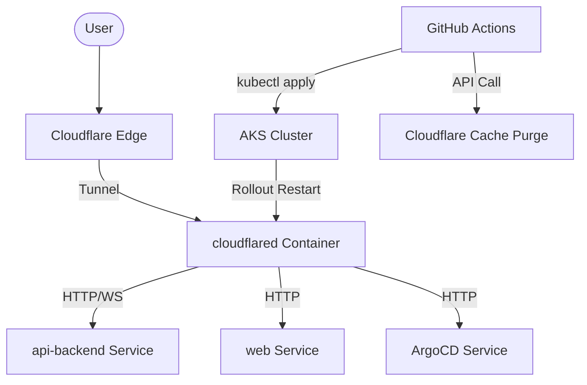

# Technical Remediation Plan: Cloudflare Tunnel 1033 & Container Stabilization

## 1. Problem Statement
The application is currently experiencing a Cloudflare Error 1033 (Tunnel Error) across all subdomains. Diagnostic audits reveal that the `cloudflared` container in the AKS cluster is failing due to missing credentials and mismatched routing configurations.

## 2. Root Cause Analysis
1.  **Missing Secret**: The `tunnel-credentials` secret is not consistently injected or maintained in the `cloudtolocalllm` namespace.
2.  **Routing Mismatch**: Legacy routing in the tunnel ConfigMap directs traffic to services that have undergone refactoring (e.g., `/ws` and `/api/tunnel` routing).
3.  **Deployment Inconsistency**: Deployments do not consistently trigger a restart of the tunnel daemon, leading to stale configurations and 1033 errors.
4.  **Cache Staleness**: Assets are served from Cloudflare's edge after deployments without a purge, leading to version mismatches and broken functionality.

## 3. Remediation Steps

### Phase 1: Infrastructure Stabilization
- **Secret Management**: Update `build-pipeline.yml` to use `jq` for secure, character-safe injection of the `CLOUDFLARE_TUNNEL_TOKEN` into the `tunnel-credentials` secret.
- **Ingress Alignment**: Refactor `k8s/deployments/overlays/managed/cloudflared-tunnel.yaml` to route all critical traffic (`/ws`, `/api/tunnel`, `/ssh`, `/api`, `/health`) to the `api-backend` service.

### Phase 2: Workflow Automation
- **Automated Restart**: Add a `kubectl rollout restart deployment/cloudflared` step to the `deploy_secrets` job in `.github/workflows/build-pipeline.yml`.
- **Cache Purge**: Implement a new job `cloudflare_cache_purge` that uses the Cloudflare API to trigger a full zone purge immediately after the `promote_to_gitops` job completes.

### Phase 3: Verification
- **Subdomain Health Check**: Use `curl` or automated browser tests to verify `app.`, `api.`, and `argocd.` subdomains.
- **Log Verification**: Ensure `cloudflared` logs show "Connected" status with no credential errors.

## 4. Architecture Diagram

## 5. Success Criteria
- [ ] Zero 1033 errors across all subdomains.
- [ ] `cloudflared` pods are in `Running` state with 0 restarts.
- [ ] Automated cache purge triggers on every successful push to `main`.
