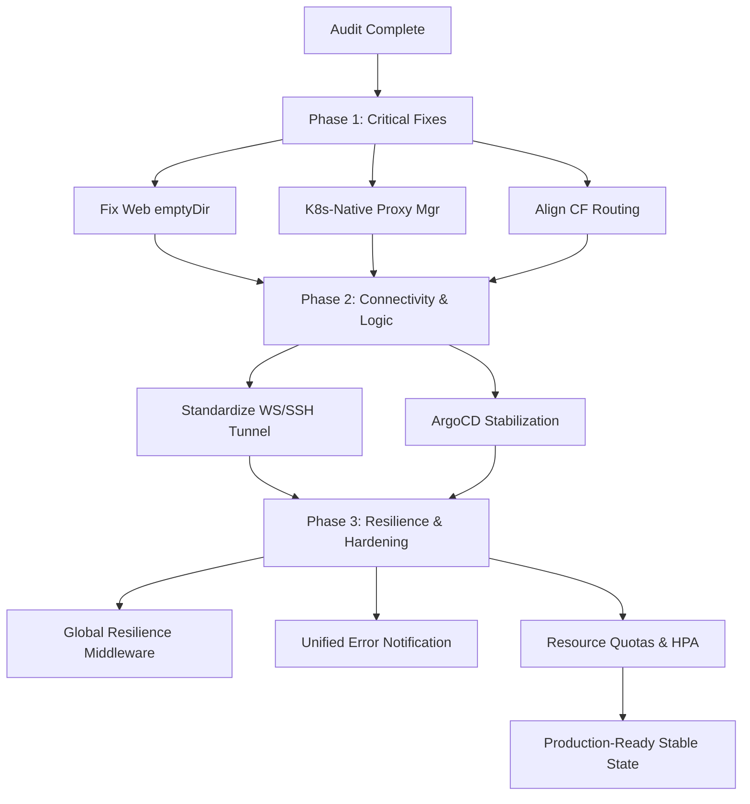

# Technical Stabilization Plan: CloudToLocalLLM

**Version:** 1.0  
**Role:** Senior Cloud Infrastructure Engineer / SRE  
**Objective:** Resolve existing points of failure and ensure production-ready stability.  
**Mandate:** Fix-only (No new features or architectural expansions).

---

## 1. Executive Summary

This plan outlines a phased approach to stabilize the CloudToLocalLLM infrastructure. The audit revealed critical issues in container orchestration, connectivity routing, and resilience middleware application. By addressing these systematically, we will achieve a stable, production-ready state with consistent uptime and reliable cloud-to-local connectivity.

---

## 2. Identified Points of Failure & Bottlenecks

### 2.1 Infrastructure & Orchestration
- **Web Deployment Bug:** The `web` deployment in `k8s/deployments/base/deployments/web.yaml` contains an `emptyDir` volume mounted at `/app`, which masks the application code in the container image.
- **Docker Socket Dependency:** `StreamingProxyManager` in `api-backend` relies on `dockerode` to manage containers. In Kubernetes, pods lack access to the Docker socket by default, causing proxy provisioning to fail.
- **ArgoCD Sync Gaps:** Lack of automated health checks and robust sync policies in the current ArgoCD configuration leads to inconsistent deployment states.

### 2.2 Connectivity & Tunneling
- **Routing Mismatch:** Cloudflare Tunnel routes `/ws` and `/api/tunnel` to `streaming-proxy`, but the `api-backend` is the primary handler for tunnel upgrades and requests.
- **Logic Ambiguity:** Conflicting implementation notes in `server.js` ("HTTP polling only" vs "WebSocket/SSH") create uncertainty in connection management.
- **Tunnel Latency:** The multi-hop path (Cloud -> Tunnel -> Local) is the primary latency bottleneck, exacerbated by lack of optimized buffer handling in the proxy.

### 2.3 Resilience & Error Handling
- **Middleware Underutilization:** Circuit breakers, retries, and graceful degradation are implemented but not globally applied to critical external service calls (Auth0, Stripe, Database).
- **Error Visibility:** The global error handler in `server.js` does not integrate with the `errorNotificationService`, leading to silent failures in production.

---

## 3. Phased Remediation Strategy

### Phase 1: Critical Stability Fixes (Immediate)
*Focus: Resolving blockers that prevent the system from functioning correctly.*

1.  **Fix Web Deployment:** Remove the `emptyDir` mount from `k8s/deployments/base/deployments/web.yaml` to allow the container to serve its bundled code.
2.  **K8s-Native Proxy Management:** Refactor `StreamingProxyManager` to use the Kubernetes API (via `kubernetes-client/javascript`) instead of `dockerode` for provisioning ephemeral pods, or mount the Docker socket (less secure, not recommended).
3.  **Align Tunnel Routing:** Update `k8s/deployments/overlays/managed/cloudflared-tunnel.yaml` to route all tunnel-related traffic (`/ws`, `/api/tunnel`, `/ssh`) to the correct service handling those requests.

### Phase 2: Connectivity & Logic Alignment (Short-term)
*Focus: Ensuring reliable communication between cloud and local components.*

1.  **Unify Tunnel Implementation:** Standardize on the WebSocket/SSH tunnel system as the primary connection method, removing deprecated polling logic to reduce complexity.
2.  **Optimize Proxy Buffering:** Tune the `streaming-proxy-manager.js` and `server.js` proxy handlers to use optimized stream buffering for LLM responses, reducing perceived latency.
3.  **Implement ArgoCD Stabilization:** Apply the configurations from `docs/plans/argocd_stabilization_plan.md`, specifically HA for the controller and enhanced sync policies with health checks.

### Phase 3: Resilience & Production Hardening (Medium-term)
*Focus: Robustness, error handling, and production-grade monitoring.*

1.  **Global Resilience Middleware:** Integrate `circuit-breaker-middleware` and `retry-middleware` into the global `setupMiddlewarePipeline` for all external service integrations.
2.  **Unified Error Handling:** Update the global error handler in `server.js` to use `errorNotificationService` for all 5xx errors, ensuring critical issues are alerted immediately.
3.  **Resource Quotas & HPA:** Apply `ResourceQuotas` to the `cloudtolocalllm` namespace and configure `HorizontalPodAutoscaler` for `api-backend` and `web` based on actual load metrics.

---

## 4. Actionable Roadmap

| Task ID | Description | Component | Priority |
| :--- | :--- | :--- | :--- |
| **STAB-01** | Remove `emptyDir` from `web.yaml` | K8s | P0 |
| **STAB-02** | Refactor `StreamingProxyManager` for K8s API | Backend | P0 |
| **STAB-03** | Update Cloudflare Tunnel Ingress rules | K8s/CF | P0 |
| **STAB-04** | Apply ArgoCD HA and Sync Policies | DevOps | P1 |
| **STAB-05** | Standardize Tunnel Logic (WS/SSH) | Backend | P1 |
| **STAB-06** | Integrate Resilience Middleware globally | Backend | P1 |
| **STAB-07** | Connect Global Error Handler to Notification Service | Backend | P2 |
| **STAB-08** | Configure Namespace Quotas and HPA | K8s | P2 |

---

## 5. Success Metrics
- **Uptime:** 99.9% for API and Web components.
- **Tunnel Reliability:** < 1% connection drop rate for active sessions.
- **MTTR:** < 15 minutes for critical service failures via automated alerting and ArgoCD self-healing.
- **Latency:** < 200ms overhead for cloud-to-local proxying (excluding network transit).

---

## 6. Mermaid Workflow: Stabilization Process

